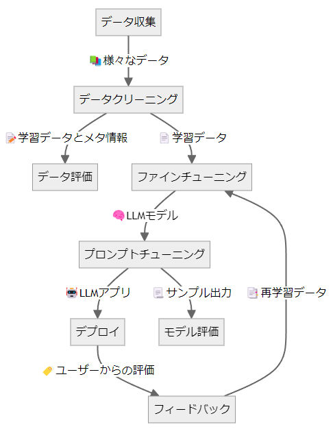

# LLMアプリケーションの作り方

LLMアプリケーションを作るには下図のように多くの工程があり、さまざまな技術やツールが必要です。これらはまとめてLLMOps（LLM Operations:大規模言語モデル運用）とも呼ばれています。

このドキュメントでは、LLMアプリケーション開発の全体像を把握するために、LLMOpsの内容とそれに対応するMDKの機能について概説します。

## データ収集

深層学習モデルの開発はデータセットの収集から始まります。LLMのファインチューニングをするには特に、LLMに回答してほしい文体や情報を含むドキュメントを収集する必要があります。データ収集は本質的なタスクであり、作りたいモデルによって収集方法が大きく異なるのでMDKはデータ収集の機能自体は持っていません。MDKの各機能を利用してLLMOpsの他の工程を高速化することで、ユーザーはデータ収集に注力することができます。

## データクリーニング

データを集めただけではモデルの学習には使用できず、適切な前処理を行って学習可能なフォーマットに揃える必要があります。たとえば[alpacaデータセット](https://huggingface.co/datasets/tatsu-lab/alpaca)のような質問回答データはSFT(Supervised Fine-tuning)、あるいは[hh-rlhfデータセット](https://huggingface.co/datasets/Anthropic/hh-rlhf)のような選好データは[DPO(Direct Preference Optimization)](https://arxiv.org/abs/2305.18290)という方式でそれぞれLLMに学習させることができます。MDKの`dataset_converter`を利用すると、多様な入力フォーマットそれぞれに合わせた前処理が自動で実行されて、SFTやDPOに合わせたフォーマットで出力します。

## データ評価

自動で作成したデータセットには、文法的な誤りや事実とは異なる情報が含まれている可能性があります。これらを完全に除去するのは手間がかかる作業ですが、MDKでは`dataset_evaluator`と`manual_dataset_evaluator`という2種類のモジュールを用いて自動あるいは手動でのデータセット評価を行うことができます。データ評価の結果が不十分である場合は、データ収集やデータクリーニングの手法を見直すことになります。

## ファインチューニング

データクリーニングが完了すると、モデルの学習を実行することができます。学習には大規模な計算資源が必要で、効率的なハードウェアの利用が求められます。MDKでは`trainer`がDeepSpeed ZeROとLoRAを用いたSFTに対応しており、効率的な学習を簡単に実行することができます。

## プロンプトチューニング

信頼できるLLMアプリケーションを作るためにはモデル本体だけでは不十分であり、適切なプロンプトチューニングやRAGを適用する必要があります。MDKの`launcher`はプロンプトチューニングやRAGに適したアプリケーションを提供しています。

## デプロイ

アプリケーションが完成すると、ウェブアプリケーションとしてデプロイすることができます。`launcher`はvLLMを利用して構築されており、高い並列度でモデルを提供することができます。

## モデル評価

LLMアプリケーションは評価指標が多岐にわたるため難易度の高いタスクの一つです。MDKでは`launcher`を利用して複数モデルを同時に推論・比較することができ、定性的な判定をすることができます。また、`model_evaluator`を利用して自動かつ定量的にモデルを評価することもできます。

## フィードバック

アプリケーションの利用者から良い回答・悪い回答についてのフィードバックを収集することで、`trainer`を使ってDPOで学習してモデルの質をさらに高めることができます。

## パイプライン

各タスクは密接に関係しており、それぞれのタスクを自動化するためのパイプラインを利用することで効率的にモデルの学習をすることができます。MDKでは`pipeline`モジュールがそれぞれのタスクを連続して実行するパイプラインを提供しています。

## 参考文献

* [LLMOpsとは(Red Hat)](https://www.redhat.com/ja/topics/ai/llmops)
* [FMOps/LLMOps:生成系AIの運用とMLOpsとの違い(Amazon)](https://aws.amazon.com/jp/blogs/news/fmops-llmops-operationalize-generative-ai-and-differences-with-mlops/)
