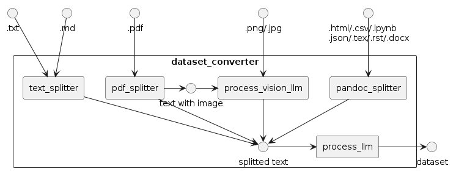

# データセット変換器の設定を変更する

MDKのデータセット生成器(`dataset_converter`)は、以下のように、ルールベースで文章を切り分ける`*_splitter`とLLMを用いてデータ変換を行う`*_llm`という2種類のコンポーネントが組み合わされてできています。



このドキュメントでは、各コンポーネントの設定項目について説明します。

## `process_llm`

`process_llm`は、LLMを用いてデータ変換を行うコンポーネントです。モデルとプロンプトについてそれぞれ設定が可能です。

### モデルの設定

生成するモデル自体を変更するには、以下のコマンドを実行します。

```sh
python src/run_dataset_converter.py inputs.name=data/OpenCL_API_23_32.pdf llm.model=<MODEL_NAME>
```

一部のモデルは利用するために認証が必要です。[Gated Modelを利用する手順](../etc/huggingface-gated-model.md)を参照してください。

同じデータを使って質問回答を何回生成するかは、`llm.generate.num_return_sequences`で指定できます。`llm.generate.temperature`を高くすることで、同じデータから大きく違った質問回答を得られやすくなります。

```sh
python src/run_dataset_converter.py inputs.name=data/OpenCL_API_23_32.pdf llm.generate.num_return_sequences=2 llm.generate.temperature=1
```

バッチサイズとGPU数の設定方法は`llm.provider`によって異なります。`llm.provider=vllm`（デフォルト）の場合、バッチサイズは`llm.vllm_max_num_seqs`パラメータ（デフォルトは256）で設定でき、GPU数は`llm.vllm_tensor_parallel_size`（デフォルトは2）で設定できます。

```terminal
$ python src/run_dataset_converter.py inputs.name=data/OpenCL_API_23_32.pdf llm.vllm_max_num_seqs=16

[2024-03-28 12:38:21,413][preprocess.llm][INFO] - llm: 545.346641 token/sec (36182 token / 66.346792 sec) with {'provider': 'vllm', 'model': 'mistralai/Mixtral-8x7B-Instruct-v0.1', 'max_tokens': 4096, 'generate': {'num_return_sequences': 4, 'max_new_tokens': 1024, 'temperature': 1, 'top_p': 0.95, 'do_sample': True}, 'batch_size': 16, 'api_base_url': 'http://localhost:8001/v1', 'api_key': 'hoge', 'vllm_tensor_parallel_size': 2, 'vllm_max_num_seqs': 16}
```

`llm.provider`が`huggingface`または`deepspeed`のときは、バッチサイズを`llm.batch_size`（デフォルトは16）で、GPU数を`CUDA_VISIBLE_DEVICES`環境変数で設定できます。

```terminal
$ CUDA_VISIBLE_DEVICES=0,1 python src/run_dataset_converter.py llm.provider=huggingface inputs.name=data/OpenCL_API_23_32.pdf llm.batch_size=4

[2024-03-28 12:47:46,743][preprocess.llm][INFO] - llm: 96.819532 token/sec (33745 token / 348.535046 sec) with {'provider': 'huggingface', 'model': 'mistralai/Mixtral-8x7B-Instruct-v0.1', 'max_tokens': 4096, 'generate': {'num_return_sequences': 4, 'max_new_tokens': 1024, 'temperature': 1, 'top_p': 0.95, 'do_sample': True}, 'batch_size': 4, 'api_base_url': 'http://localhost:8001/v1', 'api_key': 'hoge', 'vllm_tensor_parallel_size': 2, 'vllm_max_num_seqs': 256}
```

`provider=api`のときバッチサイズはサポートされていません。ただし、vLLM OpenAI APIサーバーを使うときは、`--max-num-seqs`と`--tensor-parallel-size`オプションでそれぞれ設定が可能です。

```terminal
terminal_1$ python -m vllm.entrypoints.openai.api_server --model mistralai/Mixtral-8x7B-Instruct-v0.1 --tensor-parallel-size 2 --port 8001 --max-num-seqs 16
terminal_2$ python src/run_dataset_converter.py llm.provider=api inputs.name=data/OpenCL_API_23_32.pdf

[2024-03-28 12:53:23,126][preprocess.llm][INFO] - llm: 447.148024 token/sec (33860 token / 75.724365 sec) with {'provider': 'api', 'model': 'mistralai/Mixtral-8x7B-Instruct-v0.1', 'max_tokens': 4096, 'generate': {'num_return_sequences': 4, 'max_new_tokens': 1024, 'temperature': 1, 'top_p': 0.95, 'do_sample': True}, 'batch_size': 16, 'api_base_url': 'http://localhost:8001/v1', 'api_key': 'hoge', 'vllm_tensor_parallel_size': 2, 'vllm_max_num_seqs': 256}
```

プロンプトの変更を試している場合などモデルを変えない場合は、vLLMサーバーを立ち上げっぱなしにした状態でAPIを呼ぶことで、モデルの読み込み時間を短縮することができます。

```sh
python -m vllm.entrypoints.openai.api_server --model <MODEL_NAME> --tensor-parallel-size 2 --port 8001
python src/run_dataset_converter.py llm.provider=api inputs.name=data/OpenCL_API_23_32.pdf llm.model=<MODEL_NAME>
```

### プロンプトの設定

MDKではデフォルトでいくつかのプロンプトが用意されています。

英語と日本語のものが、それぞれ`templates/en`と`templates/ja`ディレクトリに保存されています。どちらを使うのが良いかは、使うモデルと生成したい学習データによって切り替えてください。

[プロンプトを自動生成する](../dataset-evaluator/dataset-convert-prompt-generate.md)ハウツーも参照してください。

#### `qa_zeroshot_json.jinja2`（既定）

json形式で質問と回答の組を生成させるものです。プレスホルダーによってコンテキストなどが自動的に挿入されます。

```sh
python src/run_dataset_converter.py inputs.name=data/OpenCL_API_23_32.pdf prompt.template=ja/qa_zeroshot_json.jinja2
```

#### `format_zero_shot.jinja2`

改行や表形式が壊れているテキストの場合に、それを直すだけのプロンプトです。
質問回答の形式になっていないため、このまま自動評価等に使うことはできません。

```sh
python src/run_dataset_converter.py inputs.name=data/OpenCL_API_23_32.pdf prompt.template=en/format_zero_shot.jinja2
```

#### `qa_zeroshot.jinja2`

「質問と回答の組を生成させる」以外に形式などの指定をまったくしないプロンプトです。
json形式になっていないため、このまま自動評価等に使うことはできません。

```sh
python src/run_dataset_converter.py inputs.name=data/OpenCL_API_23_32.pdf prompt.template=en/qa_zeroshot.jinja2
```

#### トピックの設定

いくつかのプロンプトでは"This is a document about \{\{topic\}\}のように、文章の要約を挿入することができます。既定では`C++`になっているため、必要に応じて変更したりより詳細な情報を設定してください。

```sh
python src/run_dataset_converter.py inputs.name=data/OpenCL_API_23_32.pdf prompt.topic=\"OpenCLのAPI\"
```

## `process_vision_llm`

各画像を解釈するvision-language modelの選択と、プロンプトやトークンに関する指定が可能です。

```sh
# llava-hf/llava-1.5-13b-hfを使用して画像を読み取る
python src/run_dataset_converter.py inputs.name=<path/to/file.jpg> vision_llm.model=llava-hf/llava-1.5-13b-hf
```

## `text_splitter`

入力された長いテキストを短く分割するモジュールです。標準的には`long_char_thres`で指定した文字数で分割されます。ただし、分割境界付近での情報の欠落を防ぐため、`num_duplicate`で指定された文字数が重複して前後のバッチに含まれるようになっています。

```sh
# 入力されたテキストを500文字で分割する。ただし、各部の前後100文字ずつは、前と後ろのバッチにも重複して追加する
python src/run_dataset_converter.py inputs.name=<path/to/file.txt> splitter.long_char_thres=500 splitter.num_duplicate=100
```

markdownファイルを入力すると、分割された各テキストに対応するmarkdownタグが自動的に付加されます。分割の最大文字数は`long_char_thres`で指定し、最小値は`min_chars`で指定してください。
ただし行単位で分割するため、`long_char_thres`ぴったりにならないことがあります。

```sh
# 300文字以上、500文字以下の範囲で分割する
python src/run_dataset_converter.py inputs.name=<path/to/file.md> splitter.long_char_thres=500 splitter.min_chars=300
```

## `pdf_splitter`

PDFに含まれる画像をvision-language modelで読み取るかどうかを指定できます。

```sh
# vision-language modelを使用しない
python src/run_dataset_converter.py inputs.name=<path/to/file.pdf> vision_llm.model=null
```

## `pandoc_splitter`

pandocで読み込むことができる各種ファイルについての分割モジュールです。オプションは無く、pandocの標準に従ってテキスト変換と分割が実行されます。
