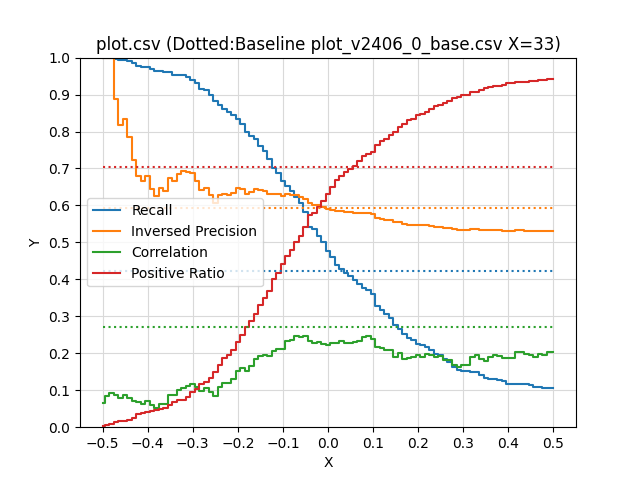

# 評価指標の設定する

## 現在の算出方法

[karakuri-ai/karakuri-lm-7b-apm-v0.1](https://huggingface.co/karakuri-ai/karakuri-lm-7b-apm-v0.1/tree/main)モデルは、下記のように複数の指標についてそれぞれ0～4の5段階のスコアを出力します。

```json
"output": [
    " helpfulness: <attr 0> correctness: <attr 1> coherence: <attr 2> complexity: <attr 3> verbosity: <attr 4> [/ATTR_1]",
    " helpfulness: <attr 0> correctness: <attr 1> coherence: <attr 2> complexity: <attr 3> verbosity: <attr 4> [/ATTR_1]",
    " helpfulness: <attr 0> correctness: <attr 1> coherence: <attr 2> complexity: <attr 3> verbosity: <attr 4> [/ATTR_1]",
    " quality: <attr 5> toxicity: <attr 6> humor: <attr 7> creativity: <attr 8> [/ATTR_2]",
    " quality: <attr 5> toxicity: <attr 6> humor: <attr 7> creativity: <attr 8> [/ATTR_2]",
    " quality: <attr 5> toxicity: <attr 6> humor: <attr 7> creativity: <attr 8> [/ATTR_2]"
],
```

* 有用性(helpfulness): `<attr 0>`
* 正確性(correctness): `<attr 1>`
* 一貫性(coherence): `<attr 2>`
* 複雑性(complexity): `<attr 3>`
* 冗長性(verbosity): `<attr 4>`
* 品質(quality): `<attr 5>`
* 毒性(toxicity): `<attr 6>`
* ユーモア(humor): `<attr 7>`
* 創造性(creativity): `<attr 8>`

これらを単一のスコアにまとめる方法として、MDKでは下記の手順を採用しています。

1. 質問回答を属性評価LLMに読み込ませ、以下の2パターンの属性を0-4の5段階でそれぞれ3回ずつ推定
   1. 有用性、正確性、一貫性、複雑性、冗長性
   1. 品質、毒性、ユーモア、創造性
1. 評価用データセットに対して、2パターンの推定結果を結合した9属性とロジスティック回帰によって算出した係数による重みづけ和として個別評価スコア(raw_score)を求める
1. 3回分の個別評価スコアを平均し単一のスコアを算出
1. clean:スコアが-0.15以下、wrong:スコアが-0.15より大きい、invalid:スコアが算出できなかった

## データセットの作成

手動評価を行った複数の結果を統合し、データセットに変換できます。
[手動評価結果をデータセットに変換する方法](../manual-dataset-evaluator/evaluation-convert-dataset.md)を参照してください。

## 係数の調整

自動評価結果（json形式）および、手動評価を行ったデータセット（xlsx形式）から、評価結果から正誤判定結果を求める係数を算出し、再調整を行います。
[正誤判定結果の自動調整方法](../dataset-evaluator/evaluation-calculate-coefficient.md)を参照してください。

## 閾値の設定

MDKでは[手動評価](../../tutorials/evaluation-human-in-the-loop.md)の結果を利用して閾値のデフォルト設定（-0.15以下でclean）が行われています。この値を変更してデータセット評価を行うには下記のように実行してください。

```sh
# 閾値を-0.5に変更
python src/run_dataset_evaluator.py inputs.name=outputs/dataset_converter/<YYYY-MM-DD>/<HH-MM-SS>/experiment_log.json llm.max_ok_error_threshold=-0.5
```

## 手動評価との比較

設定した閾値を[手動評価](../../tutorials/evaluation-human-in-the-loop.md)と比較するための可視化スクリプトも利用できます。これを利用するにはまず、`<basedir>`に下記の入力データを配置します。

* `experiment_log.json`: karakuri_apmを用いた自動評価結果
  * 絶対パスを用いて`--auto-eval-json-file <full-path-to-experiment-log.json>`とすることも可能です（この場合は`<basedir>`に置く必要はありません）
* `experimental_log_checked.xlsx`:手動評価結果。`checked`列に1が入っている各行について、`num_error`列の値が0のとき正しい、それ以外のとき誤りを含む質問回答であるというアノテーションがされていると仮定します
* `baseline_log.csv`:（オプション）比較対象の自動評価結果。`num_error`列の値が0のとき正しい、それ以外のとき誤りを含む質問回答であると認識されたと仮定します
  * `--baseline-csv-file`を指定しない場合は、ベースラインの点線を表示しません

次に、下記のコマンドを実行します。

```sh
python scripts/plot_data_karakuri_apm.py <basedir> --baseline-csv-file baseline_log.csv
```

実行後、`<basedir>`にグラフ`plot.png`とその元データ`plot.csv`が生成されます。グラフには閾値に対する各指標が記載されています。

* `Recall`:誤りがある質問回答のうち、誤りがあると判定できた割合（閾値を上げると単調に上昇する）
* `Inversed Precision`:誤りがないと判定した質問回答のうち、実際に誤りがないものの割合
* `Correlation`:人間との相関
* `Positive Ratio`:誤りがないと判定した割合（閾値を上げると単調に減少する）

現状の閾値は、`Inversed Precision`が大きく、かつ`Positive Ratio`も大きめのところでキリのいい値となる`x=-0.15`と設定しています。実際の評価対象に応じて[閾値の設定](#閾値の設定)節を参考にして、適宜調整してください。

```csv
x,recall,inversed-precision,corr,positive_ratio
...
-0.180,0.798,0.630,0.151,0.270
-0.170,0.789,0.637,0.166,0.287
-0.160,0.780,0.645,0.185,0.306
-0.150,0.760,0.642,0.192,0.331
-0.140,0.746,0.639,0.196,0.349
-0.130,0.725,0.632,0.193,0.369
-0.120,0.702,0.632,0.206,0.400
...
```


