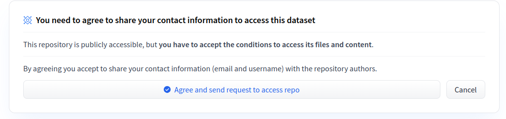
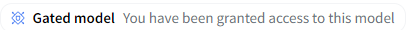

# Gated modelの利用方法

Gated modelとは、Hugging Faceからダウンロードする際に認証が必要なモデルのことです。

Gated modelを認証前に利用しようとすると、以下のエラーが出ます。URLの箇所は指定したモデルにより異なります。

```sh
huggingface_hub.utils._errors.GatedRepoError: 403 Client Error. (Request ID: Root=1-66399d06-032dff57762286d14a5b5d93;b8934a7a-2058-46c8-bf0d-7eab783ae087)

Cannot access gated repo for url https://huggingface.co/api/models/mistralai/Mixtral-8x7B-Instruct-v0.1.
Access to model mistralai/Mixtral-8x7B-Instruct-v0.1 is restricted and you are not in the authorized list. Visit https://huggingface.co/mistralai/Mixtral-8x7B-Instruct-v0.1 to ask for access.
```

このドキュメントでは、Gated modelを利用する手順を解説します。

## 前提条件

以下のチュートリアルが完了していることが必要です。

* [データセットを生成してチャットボットを展開する](../../tutorials/step-by-step.md)

チュートリアルと同様に、`cd <MDKパッケージをcloneした場所>`を行い、カレントディレクトリを変更した後に`. .venv/bin/activate`を実行し、venvを起動してください。

## 初期設定

まず[https://huggingface.co/welcome](https://huggingface.co/welcome)にアクセスして、Hugging Faceのアカウントを作成します。

次に、Hugging Faceのウェブサイトで以下の作業を実施します。

* [https://huggingface.co/settings/tokens](https://huggingface.co/settings/tokens)からRead権限でAccess Tokenを作成する
* [https://huggingface.co/settings/keys](https://huggingface.co/settings/keys)からssh公開鍵を登録する

## モデルごとの利用許諾を得る

HuggingFaceでGated Modelのページにアクセスすると以下のように表示されます。



上図の青文字で記載がある`Agree and send request to access repo`を押下してください。承認が自動化されている場合はその場ですぐにアクセスできるようになり、すぐにそのモデルを使用することができます。手動の場合はモデルの作成者が承認するのを待つ必要があります。

承認されると、対象のモデルのページにアクセスすると以下画像の表示に変わっているはずです。



## モデルを利用する

以下のコマンドを実行すると、トークンを入力するよう求められます。初期設定の際に作成したアクセストークンを入力してください。

```sh
# トークンの保存先を、共有キャッシュ${HF_HOME}とは別にユーザーごとに指定します
export HF_TOKEN_PATH=/home/$USER/.cache/huggingface/token
huggingface-cli login
```

トークンは入力中は画面に表示されないので、コピー&ペーストすると入力ミスが減ります。

入力後に`Add token as git credential? (Y/n)`と聞かれますが、nを押下してください。

実行後に`Login successful`と表示されていることを確認してください。

その後、前述のGated modelがウェブページ上でアクセス可能な状態であることも再度確認してください。

この状態であればGated modelが利用可能です。
