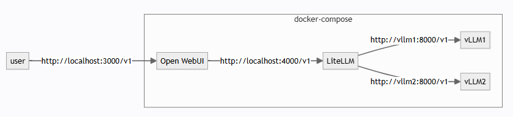
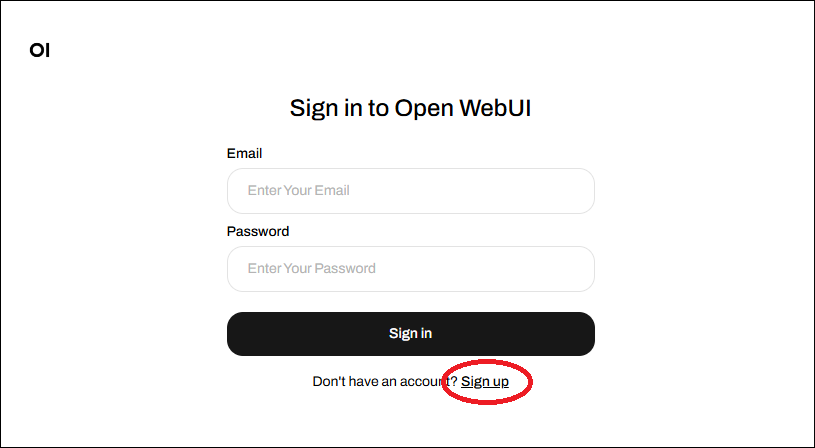

# チャットの詳細設定を変更する

チュートリアルの[step-by-step](../../tutorials/step-by-step.md)が終わってその詳細設定を変える場合は以下のハウツーを参照してください。

## チャットの構成

チャットは以下のライブラリを組み合わせたDockerコンテナの構成になっています。

* [vLLM](https://github.com/vllm-project/vllm)
* [LiteLLM](https://github.com/BerriAI/litellm)
* [Open WebUI](https://github.com/open-webui/open-webui)



## チャット環境で、ユーザー認証を使用する

以下の手順でOpen WebUIでのユーザー認証の使用/未使用を切り替えられます。

1. いったんチャットを停止します
1. `docker volume rm launcher-open-webui`コマンドでOpen WebUIの実行環境を削除します
1. サインインを使用する場合は設定ファイルで`WEBUI_AUTH: True`に設定します（使用しない場合は`False`に設定）
1. 再度チャットを起動します
1. サインインを使用する場合は`Sign up`リンクをクリックしてサインアップします
   

## 設定ファイルのテンプレートをベースに設定を変更する

* `config/launcher/checkpoint-x-merged_swallow70b.yaml`  #ファインチューニングモデルとベースモデルとの比較用
* `config/launcher/checkpoint-x-merged.yaml`  #ファインチューニングモデル用
* `config/launcher/llama3_8B_opt_350m.yaml`  # meta-llama/Meta-Llama-3-8B-Instructとfacebook/opt-350mの比較用
* `config/launcher/llama3.2_1B_3B.yaml`  # meta-llama/Llama-3.2-1B-Instructとmeta-llama/Llama-3.2-3B-Instructの比較用

上記のテンプレートを`outputs/launcher`にコピーして下記を参考に変更して利用できます。

```yaml
GPUS:  # モデルごとにGPUの連続したIDを指定します。2のn乗の個数を指定します
  - [ '0', '1', '2', '3' ]
GPU_MEMORY_UTILIZATION: 0.9  # GPUの最大使用メモリを制限します(<1.0:省略可)
LITELLM_PORT: 4000  # litellmへ直接API呼び出しする場合のポートを指定します
MODELS:  # モデルを1つまたは複数指定します(ファインチューンモデルの場合は絶対パスで指定します)
  - <path to mdk>/outputs/trainer/yyyy-mm-dd/hh-MM-ss/checkpoint-<STEP>-merged
MODEL_NAMES:  # モデルごとに任意のわかりやすい表示名を指定します
  - OpenCL-finetuned
NUM_WORKERS: 8  # Webからの同時受付数を指定します
OPEN_WEBUI_PORT: 3000  # ブラウザでチャットUIにアクセスするポートを指定します
TEMPLATES:  # モデルごとにチャットテンプレートを指定します(outputs/launcher/<config-name>からの相対パスで指定します)
  - ../../../templates/ja/launcher_llama3.jinja2
WEBUI_AUTH: False  # WebUIの認証を使用するかどうかを指定します
```

いったんチャットを停止して、以下のように新しい設定ファイルを引数として指定してチャットを起動することで新しい設定が反映されます。

```sh
(.venv) $ src/run_launcher.sh outputs/launcher/new_settings.yaml
```

## launcherを複数起動する場合

`LITELLM_PORT`と`OPEN_WEBUI_PORT`はノード内で一意である必要があるので、launcherを複数起動するときはそれぞれ異なるポート番号を指定してください。

## モデルの詳細オプションの変更

詳細設定が必要な場合には、launcherによって生成される`docker-compose.yml`を修正する必要があります。

例えば`llama3.2_1B_3B.yaml`を使う場合、まず最初に

```terminal
$ src/run_launcher.sh config/launcher/llama3.2_1B_3B.yaml

...

Config files ['docker-compose.yml', 'litellm-config.yml'] generated to outputs/launcher/llama3.2_1B_3B successfully.
```

となった後に、`outputs/launcher/llama3.2_1B_3B/docker-compose.yml`が生成されるので、この設定ファイルを修正してください。
