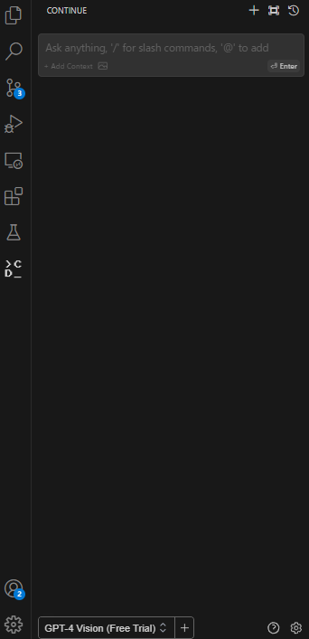

# VSCode拡張でモデルを利用する

## サービスを提供する

### 前提条件

* [launcherが利用可能であること](../../tutorials/step-by-step.md)

### 設定ファイルを利用者に渡す

MDK launcherによってAPIを用意した場合は、下記のように設定ファイルを作成して、サービス利用者に渡してください。

```json
{
  "models": [
    {
      "title": "<MODEL_NICKNAME>",
      "provider": "openai",
      "model": "<MODEL_SHORT_NAME>",
      "apiKey": "EMPTY",
      "apiBase": "http://localhost:8000/v1/"
    },
  ...
```

ここで、`<MODEL_SHORT_NAME>`はモデル名として指定した文字列のうち、最後の`/`の後の部分を指定します。たとえば、利用するモデルが`codellama/CodeLlama-7b-Instruct-hf`の場合`<MODEL_SHORT_NAME>`は`CodeLlama-7b-Instruct-hf`となります。

`<MODEL_NICKNAME>`には識別しやすい任意の名前をつけます。

## サービスを利用する

### 利用前提条件

* [VSCode](https://github.com/microsoft/vscode)がインストールされていること
* サービス提供者から、Continueの設定ファイルが与えられていること

### Continueのインストール

[Continue拡張機能](https://marketplace.visualstudio.com/items?itemName=Continue.continue)をインストールしてください。インストールが完了すると、サイドバーにContinueが追加されます。



### Continueの設定

右下の歯車マークから設定ファイルを開きます。利用者はサービス提供者から指定されたとおりに設定ファイルを変更してください。

### Continueの使い方

コード補完など使い方の詳細は[Continueのドキュメント](https://continue.dev/docs/intro)を参照してください。
