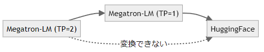
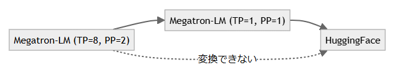

# チェックポイントの形式変換(Megatron-LM, HuggingFace Transformers)

本説明書では、Megatron-LMライブラリ形式のチェックポイントとHuggingFace Transformersライブラリ形式のチェックポイントの相互変換方法について解説します。

これによって、Megatron-LMによる効率的な学習とHuggingFaceによる幅広いモデルの利用を同時に達成することができます。

## 前提条件

本手順は以下の構成を前提としています。

* [Megatron-LMを用いた分散並列事前学習](./pretrain-megatron-lm.md)の「Megatron-LMの準備」までの設定が完了している。
* MDKのパッケージを展開済みで、`cd <MDKパッケージをcloneした場所>/outputs`を実行し、カレントディレクトリが変更済みである。

## 準備

### 変換スクリプトの用意

Llama 2, Llama 3の形式変換を行う場合は、次の手順に従い、変換スクリプトを用意する必要があります。

```sh
cd ./Megatron-LM

# Llama 2
wget https://gist.githubusercontent.com/devymex/734ff89ffb7ba047de177201ba90b3d1/raw/59d35ddb0d6c77c40b2f416d879c90b010b80d66/saver_llama2_hf.py -O tools/checkpoint/saver_llama2_hf.py
patch tools/checkpoint/saver_llama2_hf.py  ../../scripts/pretrain_megatron_lm/convert_checkpoint/saver_llama2_hf.patch

# Llama 3
wget https://gist.githubusercontent.com/devymex/734ff89ffb7ba047de177201ba90b3d1/raw/59d35ddb0d6c77c40b2f416d879c90b010b80d66/saver_llama2_hf.py -O tools/checkpoint/saver_llama3_hf.py
patch tools/checkpoint/saver_llama3_hf.py  ../../scripts/pretrain_megatron_lm/convert_checkpoint/saver_llama3_hf.patch
git apply ../../scripts/pretrain_megatron_lm/llama3_tokenizer.patch

# カレントディレクトリをoutputsに変更
cd ../
```

### HuggingFace Transformersのバージョン確認

GPT-2の形式変換を行う場合は、必ずHuggingFace Transformersのバージョンが`>=4.45.0`であることを確認してください。

```sh
singularity exec --no-home --nv ./Megatron-LM/pytorch.sif pip show transformers
```

条件を満たさない場合は、[Megatron-LMを用いた分散並列事前学習](./pretrain-megatron-lm.md)記載の手順に従って、再度Singularityイメージをビルドしてください。

以上の手順により、チェックポイントの相互変換(Megatron-LM \<\-\> HuggingFace Transformers)の準備が整いました。

### チェックポイント変換時の不具合修正

Megatron-LMのcore_r0.8.0ブランチを使ったチェックポイント変換では保存中に止まってしまうという不具合があるので、以下のパッチファイルを適用して修正します。

```sh
cd ./Megatron-LM

patch megatron/training/checkpointing.py < ../../scripts/pretrain_megatron_lm/training_checkpointing.patch

# カレントディレクトリをoutputsに変更
cd ../
```

## HuggingFace Transformers形式からMegatron-LM形式へ変換する

HuggingFace Transformers形式から、Megatron-LM形式へ変換する手順を紹介します。
まずはHuggingFaceから必要なモデルをダウンロードします。

なお、Llama 2および、Llama 3はGated modelに該当します。詳細は[Gated modelの利用方法](../etc/huggingface-gated-model.md)を参照してください。

```sh
# Llama 2
git clone git@hf.co:meta-llama/Llama-2-7b-hf

# Llama 3-8B
git clone git@hf.co:meta-llama/Meta-Llama-3-8B

# Llama 3-70B
git clone git@hf.co:meta-llama/Meta-Llama-3-70B

# Llama 3.1
git clone git@hf.co:meta-llama/Llama-3.1-8B

# Swallow Llama 3（tokenizer modelとしてLlama 3を使います）
git clone git@hf.co:meta-llama/Meta-Llama-3-8B
git clone git@hf.co:tokyotech-llm/Llama-3-Swallow-8B-Instruct-v0.1

# GPT-2
git clone git@hf.co:/openai-community/gpt2-medium
```

GPT-2は、`state_dict`の`key`を修正する必要があります。
次の手順に従い、修正を行ってください。修正後のチェックポイントは`./gpt2-medium-fixed`に出力されます。

```sh
$ . ../.venv/bin/activate
$ python3 ../scripts/pretrain_megatron_lm/convert_checkpoint/fix_statedict_key_prefix_gpt2.py \
    ./gpt2-medium \
    ./gpt2-medium-fixed
```

変換後のモデルは`--save-dir`または`--save_path`に指定したディレクトリに出力されます。

`--target-tensor-parallel-size`および`--target-pipeline-parallel-size`は学習時に使用する設定に合わせて指定してください。

```sh
# Llama 2
singularity exec --no-home --nv ./Megatron-LM/pytorch.sif \
    python3 Megatron-LM/tools/checkpoint/convert.py \
    --model-type=GPT \
    --checkpoint-type hf \
    --loader llama_mistral \
    --saver mcore \
    --target-tensor-parallel-size 1 \
    --target-pipeline-parallel-size 1 \
    --model-size llama2-7B \
    --load-dir Llama-2-7b-hf \
    --save-dir Llama-2-7b-mega-tp1-pp1 \
    --tokenizer-model Llama-2-7b-hf/tokenizer.model

# Llama 3-8B
singularity exec --no-home --nv --env TIKTOKEN_CACHE_DIR="" ./Megatron-LM/pytorch.sif \
    python3 Megatron-LM/tools/checkpoint/convert.py \
    --model-type=GPT \
    --checkpoint-type hf \
    --loader llama_mistral \
    --saver mcore \
    --target-tensor-parallel-size 1 \
    --target-pipeline-parallel-size 1 \
    --model-size llama3-8B \
    --load-dir Meta-Llama-3-8B \
    --save-dir Meta-Llama-3-8B-mega-tp1-pp1  \
    --tokenizer-model Meta-Llama-3-8B/original/tokenizer.model

# Llama 3-70B
singularity exec --no-home --nv --env TIKTOKEN_CACHE_DIR="" ./Megatron-LM/pytorch.sif \
    python3 Megatron-LM/tools/checkpoint/convert.py \
    --model-type=GPT \
    --checkpoint-type hf \
    --loader llama_mistral \
    --saver mcore \
    --target-tensor-parallel-size 8 \
    --target-pipeline-parallel-size 2 \
    --model-size llama3-70B \
    --load-dir Meta-Llama-3-70B \
    --save-dir Meta-Llama-3-70B-mega-tp8-pp2  \
    --tokenizer-model Meta-Llama-3-70B/original/tokenizer.model

# Llama 3.1
singularity exec --no-home --nv --env TIKTOKEN_CACHE_DIR="" ./Megatron-LM/pytorch.sif \
    python3 Megatron-LM/tools/checkpoint/convert.py \
    --model-type=GPT \
    --checkpoint-type hf \
    --loader llama_mistral \
    --saver mcore \
    --target-tensor-parallel-size 1 \
    --target-pipeline-parallel-size 1 \
    --model-size llama3-8B \
    --load-dir Llama-3.1-8B \
    --save-dir Llama-3.1-8B-mega-tp1-pp1  \
    --tokenizer-model Llama-3.1-8B/original/tokenizer.model

# Swallow Llama 3
singularity exec --no-home --nv --env TIKTOKEN_CACHE_DIR="" ./Megatron-LM/pytorch.sif \
    python3 Megatron-LM/tools/checkpoint/convert.py \
    --model-type=GPT \
    --checkpoint-type hf \
    --loader llama_mistral \
    --saver mcore \
    --target-tensor-parallel-size 1 \
    --target-pipeline-parallel-size 1 \
    --model-size llama3-8B \
    --load-dir Llama-3-Swallow-8B-Instruct-v0.1 \
    --save-dir Llama-3-Swallow-8B-Instruct-v0.1-mega-tp1-pp1  \
    --tokenizer-model Meta-Llama-3-8B/original/tokenizer.model


# GPT-2
singularity exec --no-home --nv ./Megatron-LM/pytorch.sif \
    python3 -m transformers.models.megatron_gpt2.checkpoint_reshaping_and_interoperability \
    --megatron-path Megatron-LM \
    --load_path gpt2-medium-fixed \
    --save_path gpt2-medium-mega-tp1-pp1 \
    --tokenizer_name gpt2 \
    --max_shard_size 200MB \
    --print-checkpoint-structure
```

なお、Llamaモデル変換時の引数に、`--model-type=GPT`や`--loader llama_mistral`が指定されていますが、これはMegatron-LMの仕様上の名称であり、Llamaを対象とする場合にはこのオプション名を用いてください。（次節の場合も同様）

## Megatron-LM形式からHuggingFace Transformers形式へ変換する

Megatron-LM形式からHuggingFace Transformers形式への変換手順を紹介します。

なお、ここで使用するのは前節で作成したMegatron-LM形式のチェックポイントです。

変換後のモデルは`--save-dir`に指定したディレクトリに出力されます。ただし、`convert_megatron_gpt2_checkpoint.py`を使用するGPT-2の場合は、変換前のチェックポイントと同じディレクトリに`pytorch_model.bin`というファイル名で出力されます。

```sh
# Llama 2
singularity exec --no-home --nv ./Megatron-LM/pytorch.sif \
    python3 Megatron-LM/tools/checkpoint/convert.py \
    --megatron-path=Megatron-LM \
    --model-type=GPT \
    --loader=mcore \
    --saver=llama2_hf \
    --load-dir=Llama-2-7b-mega-tp1-pp1 \
    --save-dir=Llama-2-7b-mega-hf

# Llama 3-8B
singularity exec --no-home --nv ./Megatron-LM/pytorch.sif \
    python3 Megatron-LM/tools/checkpoint/convert.py \
    --model-type=GPT \
    --megatron-path=Megatron-LM \
    --loader=mcore \
    --saver=llama3_hf \
    --load-dir=Meta-Llama-3-8B-mega-tp1-pp1 \
    --save-dir=Meta-Llama-3-8B-mega-hf

# Llama 3-70B
singularity exec --no-home --nv ./Megatron-LM/pytorch.sif \
    python3 Megatron-LM/tools/checkpoint/convert.py \
    --model-type=GPT \
    --megatron-path=Megatron-LM \
    --loader=mcore \
    --saver=llama3_hf \
    --load-dir=Meta-Llama-3-70B-mega-tp1-pp1 \
    --save-dir=Meta-Llama-3-70B-mega-hf

# Llama 3.1
singularity exec --no-home --nv ./Megatron-LM/pytorch.sif \
    python3 Megatron-LM/tools/checkpoint/convert.py \
    --model-type=GPT \
    --megatron-path=Megatron-LM \
    --loader=mcore \
    --saver=llama3_hf \
    --load-dir Llama-3.1-8B-mega-tp1-pp1 \
    --save-dir Llama-3.1-8B-mega-hf

# GPT-2
singularity exec \
    --no-home \
    --nv \
    --bind /data/cache:/data/cache \
    --env HF_HOME=/data/cache/huggingface \
    ./Megatron-LM/pytorch.sif \
    python3 -m transformers.models.megatron_gpt2.convert_megatron_gpt2_checkpoint \
    gpt2-medium-mega/release/mp_rank_00/model_optim_rng.pt
```

## 並列数(TP, PP)が異なる場合

Tensor Parallel size (TP)やPipeline Parallel size (PP)を変えて学習している場合は上記手順だけでは変換できず、TPとPPのみの変換を経由する必要があります。

* 
* 

下記のコマンド例と注意事項を参考に、モデルを変換してください。

* megatron legacyとmegatron coreではパラメータの保存形式が異なります。`--loader`と`--saver`を明示的に設定してください
* モデルやTPの変換内容によってはvocab sizeの調整が必要になることがあります。`--true-vocab-size`で変換後のvocab sizeを明示的に指定してください
* モデルのうち重みのみ変換し勾配は変換されないため、変換後のモデルを使って学習する際は`--finetune`オプションを追加してください

```sh
cd ./Megatron-LM

# TP=8, PP=2からTP=1, PP=1へ変換する
singularity exec --no-home --nv --bind ./cache:$HOME/.triton/cache --bind ../:/outputs ./pytorch.sif \
    python3 tools/checkpoint/convert.py \
    --model-type GPT \
    --loader mcore \
    --saver mcore \
    --load-dir=/outputs/Meta-Llama-3-70B-mega/<YYYY-MM-DD>/<HH-MM-SS> \
    --save-dir=/outputs/Meta-Llama-3-70B-mega-tp1-pp1 \
    --target-tensor-parallel-size 1 \
    --target-pipeline-parallel-size 1 \
    --megatron-path ./ \
    --true-vocab-size 128256

# カレントディレクトリをoutputsに変更
cd ../

# HuggingFace Transformers形式へ変換が可能
singularity exec --no-home --nv ./Megatron-LM/pytorch.sif \
    python3 Megatron-LM/tools/checkpoint/convert.py \
    --model-type=GPT \
    --loader=mcore \
    --megatron-path=Megatron-LM \
    --saver=llama3_hf \
    --load-dir=Meta-Llama-3-70B-mega-tp1-pp1 \
    --save-dir=Meta-Llama-3-70B-mega-tp1-pp1-hf
```

## pytorch_model.bin形式からmodel.safetensors形式へ変換する

pytorch_model.bin形式から、より新しく安全高速で互換性も高いmodel.safetensors形式へ変換するには以下の手順を実行してください。

```sh
pushd ../scripts/pretrain_megatron_lm/convert_checkpoint/
wget https://raw.githubusercontent.com/huggingface/safetensors/refs/tags/v0.5.3/bindings/python/convert.py
python run_convert.py --input ../../../outputs/Meta-Llama-3-8B-mega-tp1-pp1-hf/pytorch_model.bin --output ../../../outputs/Meta-Llama-3-8B-mega-tp1-pp1-hf/model.safetensors
popd
```

## 次にやること

[HuggingFace Transformers形式のチェックポイントの行列を比較する](./compare-checkpoint-hf.md)を実施し、形式変換前後のチェックポイントの行列比較を行いましょう。行列比較を行うことで、変換が正常に行われているかを確認することができます。
