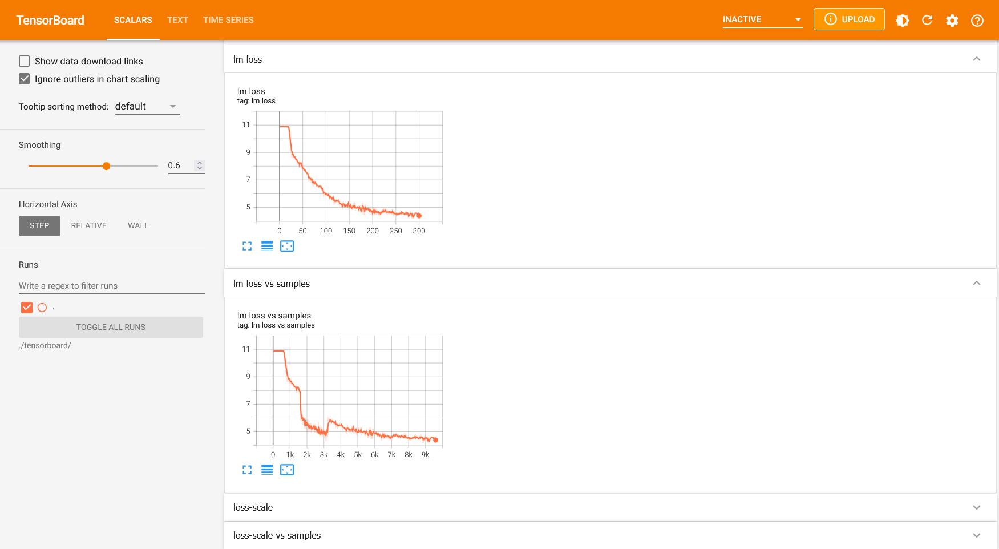

# Megatron-LMを用いた分散並列事前学習

## 前提条件

本手順は以下の構成を前提としています。

* FAIBサーバー上である
  * MPI、Singularity、マルチノードの通信設定が完了しているはずです
* MDKのパッケージを展開済みで、`cd <MDKパッケージをcloneした場所>`を実行し、カレントディレクトリを変更済み

## Megatron-LMの準備

Megatron-LMのソースコード一式と、Megatron-LMを動作させるSingularityイメージを準備します。

```sh
# outputsディレクトリを作成する
mkdir -p outputs

# outputsディレクトリに移動する
cd outputs
```

Megatron-LMのリポジトリをcloneします。

```sh
# Megatron-LMのリポジトリをcloneする
git clone https://github.com/NVIDIA/Megatron-LM -b core_r0.8.0

# Megatron-LMディレクトリに移動する
cd Megatron-LM/
```

Singularityイメージをビルドします。
`.def`ファイルは、DockerのDockerfileに相当するものです。

```sh
singularity build --fakeroot ./pytorch.sif ../../scripts/pretrain_megatron_lm/pytorch.def
```

`pytorch.sif`が生成されます。

ホストのMPIとSingularityコンテナ内部のMPIはパッチパージョンを除いて揃える必要があるため、それぞれのバージョンを確認します。

```sh
# ホストのMPIのバージョンを確認する
$ mpirun --version
mpirun (Open MPI) 5.0.5

# Singularityコンテナ内部のMPIのバージョンを確認する
$ singularity exec ./pytorch.sif mpirun --version
mpirun (Open MPI) 5.0.5
```

これまでの手順により、Megatron-LMを用いた分散学習の実行環境が整いました。

## 事前学習の実行

### データセットの前処理

データセットとモデル設定をダウンロードします。
ここでは、redpajamaデータセットとGPT2モデル設定を使用する例を説明します。

```sh
# Megatron-LMのリポジトリに移動する
cd outputs/Megatron-LM

# redpajamaデータセットをダウンロードする
wget https://data.together.xyz/redpajama-data-1T/v1.0.0/arxiv/arxiv_024de5df-1b7f-447c-8c3a-51407d8d6732.jsonl -O arxiv.jsonl

# GPT2モデル設定をダウンロードする
git clone https://huggingface.co/openai-community/gpt2
```

データセットの前処理を実行します。

```sh
$ singularity exec --nv ./pytorch.sif python tools/preprocess_data.py --input arxiv.jsonl --output-prefix arxiv --tokenizer-type GPT2BPETokenizer --vocab-file ./gpt2/vocab.json --merge-file ./gpt2/merges.txt --workers 64 --append-eod
Time to startup: 0.46127963066101074
Processed 1000 documents (213.21634023648727 docs/s, 12.89286721539715 MB/s).
Processed 2000 documents (313.37625893373274 docs/s, 18.693108306536274 MB/s).
Processed 3000 documents (296.51905218340573 docs/s, 17.07249054298384 MB/s).
Processed 4000 documents (305.03451743758814 docs/s, 17.602500578125422 MB/s).
Processed 5000 documents (336.405264500362 docs/s, 19.420013975927866 MB/s).
Processed 6000 documents (372.2230778709407 docs/s, 21.22232861256331 MB/s).
Processed 7000 documents (329.84592813324434 docs/s, 18.99226014736072 MB/s).
Processed 8000 documents (352.20768838680584 docs/s, 20.452761615335458 MB/s).
Processed 9000 documents (369.93606594933385 docs/s, 21.43710303489737 MB/s).
Processed 10000 documents (336.24520025525845 docs/s, 19.545414270959643 MB/s).
Processed 11000 documents (356.8234652946698 docs/s, 20.291793772686933 MB/s).
Processed 12000 documents (376.2341878799837 docs/s, 21.09988781068354 MB/s).
Processed 13000 documents (365.09137382854584 docs/s, 20.57367621518333 MB/s).
```

トークン列に変換されたデータセットである`.bin`ファイルと、トークン列中の各ドキュメントの位置を示す`.idx`ファイルが生成されていることを確認します。

```terminal
$ ls arxiv*
arxiv.jsonl  arxiv_text_document.bin  arxiv_text_document.idx
```

### 事前学習スクリプトの書き換え

MPIを用いて7B事前学習を実行するために学習スクリプトを変更します。
スクリプトの変更はパッチファイル`mdk/scripts/pretrain_megatron_lm/pretrain_7b_mpi.patch`を適用します。

```sh
# サンプルの学習スクリプトをコピーして編集用の学習スクリプトを新規作成する
$ cp examples/gpt3/train_gpt3_175b_distributed.sh examples/gpt3/train_gpt3_7b_mpi.sh

# 7Bモデルの学習用の設定に変更する
$ patch -l examples/gpt3/train_gpt3_7b_mpi.sh < ../../scripts/pretrain_megatron_lm/pretrain_7b_mpi.patch
```

学習スクリプト`examples/gpt3/train_gpt3_7b_mpi.sh`では、GPT2モデル設定を引数で受け取ってGPT3 7Bモデルの事前学習を実行します。
その他のモデルサイズへの変更は[Megatron-LMのREADME](https://github.com/NVIDIA/Megatron-LM/tree/main?tab=readme-ov-file#training-speed-and-scalability)を参考にしてください。

### Megatron-LM学習スクリプトのMLflow対応

MLflowを使って実験管理を行えるようにするため、Megatron-LMの学習クリプトを変更します。スクリプトの変更はパッチファイル`mdk/scripts/pretrain_megatron_lm/training_mlflow.patch`を適用します。

```sh
# MLflowでの管理を有効にし、日時サブフォルダへチェックポイントを保存するように変更する
$ patch megatron/training/training.py < ../../scripts/pretrain_megatron_lm/training_mlflow.patch
```

MLflowで実験管理を開始する方法および結果の閲覧方法は[MLflowを使う](../trainer/use-mlflow.md)ハウツーを参考にしてください。標準では`Run Name`が日時サブフォルダ`./<CHECKPOINT_SAVE_PATH>/<YYYY-MM-DD>/<HH-MM-SS>`となります。またargsの全パラメータを記録します。必要に応じて`megatron/training/training.py`を編集して管理項目を追加してください。

### シングルノード実行

まずはシングルノードで学習を実行します。
保存先として`./checkpoint_1node`を指定すると、標準で10000イテレーションごとにチェックポイントが日時サブフォルダ`./checkpoint_1node/<YYYY-MM-DD>/<HH-MM-SS>`に保存されます。

```sh
$ mpirun --np 8 /opt/singularity/bin/singularity exec --nv ./pytorch.sif bash examples/gpt3/train_gpt3_7b_mpi.sh ./checkpoint_1node ./tensorboard ./gpt2/vocab.json ./gpt2/merges.txt ./arxiv_text_document
[before the start of training step] datetime: 2024-09-03 15:52:43
 [2024-09-03 15:54:54] iteration       10/  500000 | consumed samples:        10240 | elapsed time per iteration (ms): 13035.3 | throughput per GPU (TFLOP/s/GPU): 812.5 | learning rate: 0.000000E+00 | global batch size:  1024 | loss scale: 8388608.0 | number of skipped iterations:  10 | number of nan iterations:   0 |
Number of parameters in transformer layers in billions:  6.02
Number of parameters in embedding layers in billions: 0.41
Total number of parameters in billions: 6.44
Number of parameters in most loaded shard in billions: 6.4367
Theoretical memory footprints: weight and optimizer=46038.57 MB
 [2024-09-03 15:56:55] iteration       20/  500000 | consumed samples:        20480 | elapsed time per iteration (ms): 12137.8 | throughput per GPU (TFLOP/s/GPU): 872.5 | learning rate: 6.976744E-07 | global batch size:  1024 | lm loss: 1.064275E+01 | loss scale: 262144.0 | grad norm: 47.021 | number of skipped iterations:   5 | number of nan iterations:   0 |
[Rank 0] (after 20 iterations) memory (MB) | allocated: 48465.275390625 | max allocated: 75078.4326171875 | reserved: 75682.0 | max reserved: 75682.0
 [2024-09-03 15:58:56] iteration       30/  500000 | consumed samples:        30720 | elapsed time per iteration (ms): 12068.8 | throughput per GPU (TFLOP/s/GPU): 877.5 | learning rate: 2.093023E-06 | global batch size:  1024 | lm loss: 8.995420E+00 | loss scale: 262144.0 | grad norm: 6.042 | number of skipped iterations:   0 | number of nan iterations:   0 |
 [2024-09-03 16:00:56] iteration       40/  500000 | consumed samples:        40960 | elapsed time per iteration (ms): 12036.3 | throughput per GPU (TFLOP/s/GPU): 879.9 | learning rate: 3.488372E-06 | global batch size:  1024 | lm loss: 8.519848E+00 | loss scale: 262144.0 | grad norm: 5.818 | number of skipped iterations:   0 | number of nan iterations:   0 |
 [2024-09-03 16:02:57] iteration       50/  500000 | consumed samples:        51200 | elapsed time per iteration (ms): 12056.1 | throughput per GPU (TFLOP/s/GPU): 878.5 | learning rate: 4.744186E-06 | global batch size:  1024 | lm loss: 8.219823E+00 | loss scale: 131072.0 | grad norm: 35.929 | number of skipped iterations:   1 | number of nan iterations:   0 |
 [2024-09-03 16:04:57] iteration       60/  500000 | consumed samples:        61440 | elapsed time per iteration (ms): 12072.4 | throughput per GPU (TFLOP/s/GPU): 877.3 | learning rate: 6.139535E-06 | global batch size:  1024 | lm loss: 7.748981E+00 | loss scale: 131072.0 | grad norm: 13.307 | number of skipped iterations:   0 | number of nan iterations:   0 |
 [2024-09-03 16:06:58] iteration       70/  500000 | consumed samples:        71680 | elapsed time per iteration (ms): 12090.5 | throughput per GPU (TFLOP/s/GPU): 876.0 | learning rate: 7.534884E-06 | global batch size:  1024 | lm loss: 7.191251E+00 | loss scale: 131072.0 | grad norm: 6.798 | number of skipped iterations:   0 | number of nan iterations:   0 |
 [2024-09-03 16:08:59] iteration       80/  500000 | consumed samples:        81920 | elapsed time per iteration (ms): 12099.3 | throughput per GPU (TFLOP/s/GPU): 875.3 | learning rate: 8.930233E-06 | global batch size:  1024 | lm loss: 6.696725E+00 | loss scale: 131072.0 | grad norm: 5.787 | number of skipped iterations:   0 | number of nan iterations:   0 |
 [2024-09-03 16:11:00] iteration       90/  500000 | consumed samples:        92160 | elapsed time per iteration (ms): 12099.4 | throughput per GPU (TFLOP/s/GPU): 875.3 | learning rate: 1.032558E-05 | global batch size:  1024 | lm loss: 6.244888E+00 | loss scale: 131072.0 | grad norm: 5.634 | number of skipped iterations:   0 | number of nan iterations:   0 |
 [2024-09-03 16:13:01] iteration      100/  500000 | consumed samples:       102400 | elapsed time per iteration (ms): 12104.3 | throughput per GPU (TFLOP/s/GPU): 875.0 | learning rate: 1.172093E-05 | global batch size:  1024 | lm loss: 5.847192E+00 | loss scale: 131072.0 | grad norm: 7.679 | number of skipped iterations:   0 | number of nan iterations:   0 |
```

* ※ 初回実行時に`[INFO     | DotProductAttention]: Running with FusedAttention backend (sub-backend 1)`のようなメッセージが大量に出力される場合があります。その場合は、プログラムを終了し再度実行してください。

### マルチノード実行（2ノード）

並列数を変更してマルチノードで学習を実行します。
それに伴いチェックポイントのディレクトリを`./checkpoint_2node`に変更します。

```sh
$ mpirun --np 16 /opt/singularity/bin/singularity exec --nv ./pytorch.sif bash examples/gpt3/train_gpt3_7b_mpi.sh ./checkpoint_2node ./tensorboard ./gpt2/vocab.json ./gpt2/merges.txt ./arxiv_text_document
[before the start of training step] datetime: 2024-09-03 16:36:07
 [2024-09-03 16:38:39] iteration       10/  500000 | consumed samples:        10240 | elapsed time per iteration (ms): 15210.6 | throughput per GPU (TFLOP/s/GPU): 748.3 | learning rate: 0.000000E+00 | global batch size:  1024 | loss scale: 8388608.0 | number of skipped iterations:  10 | number of nan iterations:   0 |
Number of parameters in transformer layers in billions:  6.02
Number of parameters in embedding layers in billions: 0.41
Total number of parameters in billions: 6.44
Number of parameters in most loaded shard in billions: 6.4367
Theoretical memory footprints: weight and optimizer=41434.72 MB
 [2024-09-03 16:41:02] iteration       20/  500000 | consumed samples:        20480 | elapsed time per iteration (ms): 14351.0 | throughput per GPU (TFLOP/s/GPU): 793.1 | learning rate: 6.976744E-07 | global batch size:  1024 | lm loss: 1.062389E+01 | loss scale: 262144.0 | grad norm: 46.226 | number of skipped iterations:   5 | number of nan iterations:   0 |
[Rank 0] (after 20 iterations) memory (MB) | allocated: 42358.798828125 | max allocated: 70522.5751953125 | reserved: 71202.0 | max reserved: 71202.0
 [2024-09-03 16:43:24] iteration       30/  500000 | consumed samples:        30720 | elapsed time per iteration (ms): 14197.6 | throughput per GPU (TFLOP/s/GPU): 801.7 | learning rate: 2.093023E-06 | global batch size:  1024 | lm loss: 9.001943E+00 | loss scale: 262144.0 | grad norm: 7.882 | number of skipped iterations:   0 | number of nan iterations:   0 |
 [2024-09-03 16:45:45] iteration       40/  500000 | consumed samples:        40960 | elapsed time per iteration (ms): 14099.7 | throughput per GPU (TFLOP/s/GPU): 807.3 | learning rate: 3.488372E-06 | global batch size:  1024 | lm loss: 8.512518E+00 | loss scale: 262144.0 | grad norm: 6.455 | number of skipped iterations:   0 | number of nan iterations:   0 |
 [2024-09-03 16:48:06] iteration       50/  500000 | consumed samples:        51200 | elapsed time per iteration (ms): 14124.1 | throughput per GPU (TFLOP/s/GPU): 805.9 | learning rate: 4.883721E-06 | global batch size:  1024 | lm loss: 8.151863E+00 | loss scale: 262144.0 | grad norm: 14.762 | number of skipped iterations:   0 | number of nan iterations:   0 |
 [2024-09-03 16:50:28] iteration       60/  500000 | consumed samples:        61440 | elapsed time per iteration (ms): 14176.3 | throughput per GPU (TFLOP/s/GPU): 802.9 | learning rate: 6.279070E-06 | global batch size:  1024 | lm loss: 7.673812E+00 | loss scale: 262144.0 | grad norm: 28.819 | number of skipped iterations:   0 | number of nan iterations:   0 |
 [2024-09-03 16:52:50] iteration       70/  500000 | consumed samples:        71680 | elapsed time per iteration (ms): 14200.2 | throughput per GPU (TFLOP/s/GPU): 801.6 | learning rate: 7.674419E-06 | global batch size:  1024 | lm loss: 7.120761E+00 | loss scale: 262144.0 | grad norm: 9.713 | number of skipped iterations:   0 | number of nan iterations:   0 |
 [2024-09-03 16:55:12] iteration       80/  500000 | consumed samples:        81920 | elapsed time per iteration (ms): 14212.7 | throughput per GPU (TFLOP/s/GPU): 800.9 | learning rate: 9.069767E-06 | global batch size:  1024 | lm loss: 6.631718E+00 | loss scale: 262144.0 | grad norm: 6.449 | number of skipped iterations:   0 | number of nan iterations:   0 |
 [2024-09-03 16:57:34] iteration       90/  500000 | consumed samples:        92160 | elapsed time per iteration (ms): 14182.6 | throughput per GPU (TFLOP/s/GPU): 802.6 | learning rate: 1.046512E-05 | global batch size:  1024 | lm loss: 6.226320E+00 | loss scale: 262144.0 | grad norm: 4.546 | number of skipped iterations:   0 | number of nan iterations:   0 |
 [2024-09-03 16:59:56] iteration      100/  500000 | consumed samples:       102400 | elapsed time per iteration (ms): 14234.7 | throughput per GPU (TFLOP/s/GPU): 799.6 | learning rate: 1.186047E-05 | global batch size:  1024 | lm loss: 5.806238E+00 | loss scale: 262144.0 | grad norm: 7.296 | number of skipped iterations:   0 | number of nan iterations:   0 |
```

### TensorBoardによる学習ログの確認

学習を実行すると`tensorboard`ディレクトリにTensorBoard形式の学習ログが保存されます。
以下のコマンドを実行し、ウェブブラウザを介してTensorBoardを開きます。

```sh
$ singularity exec --nv --no-home ./pytorch.sif tensorboard --logdir ./tensorboard/
TensorFlow installation not found - running with reduced feature set.

NOTE: Using experimental fast data loading logic. To disable, pass
    "--load_fast=false" and report issues on GitHub. More details:
    https://github.com/tensorflow/tensorboard/issues/4784

TensorBoard 2.16.2 at http://ubuntu:6006/ (Press CTRL+C to quit)
```

起動後、ポート転送を使うと[http://localhost:6006](http://localhost:6006)から、下記のような画面でウェブブラウザ上から学習ログを確認できます。
FAIBサーバーにおいてはファイアーウォールが設定されておりポート6006に直接アクセスできないため、説明書を参照してポート転送してください。



lossが下がってることを確認します。

### 学習の再開

中断された学習を途中から再開するには、`pretrain_gpt.py`の`--load`変数に保存先ディレクトリを直接指定する必要があります。スクリプトから`--load <checkpoint_basedir>`と指定すると、`<checkpoint_basedir>/last_checkpoint_iteration.txt`に記載されたイテレーションから学習を再開します。チェックポイント保存先ディレクトリの指定は`examples/gpt3/train_gpt3_7b_mpi.sh`の`CHECKPOINT_PATH=$1`を変更して指定することができます。

`--load <checkpoint_basedir>/iter_<specific_iteration>`のように指定すると、学習が再開されるのではなく、データローダーがリセットされて最初のデータから再学習が始まることに注意してください。

## 推論の実行

学習したチェックポイントを用いて推論します。
推論スクリプトを準備するために、パッチファイル`mdk/scripts/pretrain_megatron_lm/inference_7b_mpi.patch`を適用します。

```sh
# サンプルの学習スクリプトをコピーして推論スクリプトを作成する
cp examples/gpt3/train_gpt3_175b_distributed.sh examples/gpt3/inference_gpt3_7b_mpi.sh

# 内部で実行するpythonスクリプトの変更と、モデルパラメータの変更を実施する
patch -l examples/gpt3/inference_gpt3_7b_mpi.sh < ../../scripts/pretrain_megatron_lm/inference_7b_mpi.patch

# 推論サーバーのバグを修正する
git cherry-pick af51a1535af8eea40c315db64f2ff8c53f1737e0
```

推論サーバを起動します。

モデルを学習したノード数と同じ数を`--np`の後に指定してください。
以下は2ノードで学習したモデルで推論をする例です。

```sh
$ mpirun --np 2 /opt/singularity/bin/singularity exec --nv ./pytorch.sif bash examples/gpt3/inference_gpt3_7b_mpi.sh ./checkpoint_2node/2025-02-06/09-32-12 ./tensorboard ./gpt2/vocab.json ./gpt2/merges.txt ./arxiv_text_document
 loading checkpoint from ./checkpoint_2node/2025-02-06/09-32-12 at iteration 100
 checkpoint version 3.0
  successfully loaded checkpoint from ./checkpoint_2node/2025-02-06/09-32-12 [ t 0, p 0 ] at iteration 100
 * Serving Flask app 'megatron.inference.text_generation_server'
 * Debug mode: off
INFO:werkzeug:WARNING: This is a development server. Do not use it in a production deployment. Use a production WSGI server instead.
 * Running on all addresses (0.0.0.0)
 * Running on http://127.0.0.1:8028
```

推論クライアントを実行します。

```sh
$ singularity exec --nv ./pytorch.sif python tools/text_generation_cli.py localhost:8028
Enter prompt: hi
Enter number of tokens to generate: 30
Megatron Response:
hi Oz far (%.1 mosqu cs- Consumptionysics discipline Entreprene aversion knowsomeoneduct
 veteran mosquesknbCan to bushmodels dominating

Dun $
Enter prompt:
```

プロンプトに対してレスポンスがあることを確認してください。

## 次にやること

Megatron-LMを使って別のモデルを学習するには[学習対象のモデルを選ぶハウツー](./train-model.md)を参照してください。
学習タスクごとに使用するGPUを変更したい場合や、学習を高速化するオプションを適用したい場合は[Megatron-LMの学習設定を変更するハウツー](./pretrain-megatron-lm-settings.md)を参照してください。
