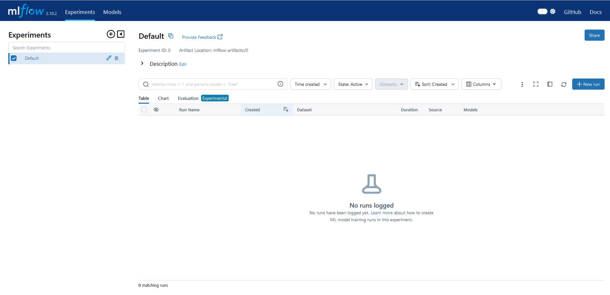

# MLflowを使う

MDKでは、学習中にMLflowを使うことができます。

ここでは作業環境がFAIBサーバー上であり、MLflowサーバーが[http://localhost:5000](http://localhost:5000)で起動しているとします。
以下の環境変数を設定後、学習スクリプトを起動してください。

```sh
export MLFLOW_TRACKING_URI=http://localhost:5000
export MLFLOW_EXPERIMENT_NAME=<ExperimentName>
```

他の場所で起動しているMLflowサーバーを使う場合は`MLFLOW_TRACKING_URI`を変更してください。名前をつけて実験管理をしたい場合は`MLFLOW_EXPERIMENT_NAME`を設定してください。

ただし、FAIBサーバーにおいてはファイアーウォールが設定されておりポート5000に直接アクセスできないため、説明書を参照してポート転送してください。

ブラウザを開くと以下のような画面が表示されるはずです。


