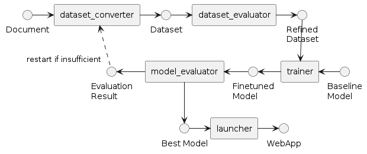

# パイプラインを自動実行するチュートリアル

このチュートリアルでは、MDKで提供されているパイプラインを自動で作成する手順を解説します。



## 前提条件

以下のチュートリアルが完了していることが必要です。

* [データセットを生成してチャットボットを展開する](./step-by-step.md)
* [データセットとモデルを評価する](./evaluation.md)

また、上記チュートリアルで実施したように`nvitop`コマンドを利用してGPUが空いていることを確認してください。

## パイプラインを実行する

データを入力するだけで、パイプライン全体が実行され、データセットの生成からモデルの学習と評価までが完了します。

```terminal
$ python src/run_pipeline.py data/OpenCL_API_23_32.pdf --num-repeat 3

The pipeline started.

pipeline #0 | dataset_converter
pipeline #0 | dataset_evaluator
data size: 44
pipeline #0 | trainer
pipeline #0 | model_evaluator
pipeline #0 | model selector
openai:completion:finetuned : 43.1818 %
openai:completion:baseline : 31.8182 %
the new model is better than the baseline. set new model to next baseline

pipeline #1 | dataset_converter
pipeline #1 | dataset_evaluator
data size: 105
pipeline #1 | trainer
pipeline #1 | model_evaluator
pipeline #1 | model selector
openai:completion:finetuned : 34.2857 %
openai:completion:baseline : 41.9048 %
the new model is worse than the baseline.

pipeline #1 | dataset_converter
pipeline #1 | dataset_evaluator
data size: 171
pipeline #1 | trainer
pipeline #1 | model_evaluator
pipeline #1 | model selector
openai:completion:finetuned : 37.4269 %
openai:completion:baseline : 41.5204 %
the new model is worse than the baseline.

|   run_id |   finetuned |   baseline |   dataset_converter |   dataset_evaluator |   num_lines |   trainer |   model_evaluator |   model_selector |   diff |
|---------:|------------:|-----------:|--------------------:|--------------------:|------------:|----------:|------------------:|-----------------:|-------:|
|        0 |       43.18 |      31.82 |              115.74 |              141.65 |       44.00 |   1322.57 |            890.77 |             0.06 |  11.36 |
|        1 |       34.29 |      41.90 |              111.02 |              151.05 |      105.00 |   1497.34 |            829.73 |             9.36 |  -7.62 |
|        2 |       37.43 |      41.52 |              114.09 |              142.78 |      171.00 |   1732.63 |            892.42 |             8.05 |  -4.09 |
summary file is in outputs/pipeline/<YYYYMMDD_HHMMSS>/summary.csv

The output directory outputs/pipeline/<YYYYMMDD_HHMMSS> contains 586.94 GB.
Please delete unnecessary files to add space.

best model: outputs/pipeline/<YYYYMMDD_HHMMSS>/0_trainer/checkpoint-20-merged

To launch webapp, please execute `python src/run_launcher.py outputs/pipeline/<YYYYMMDD_HHMMSS>/0_trainer/checkpoint-20-merged <BASELINE_MODEL_NAME>`.

To resume this pipeline, please execute `python src/run_pipeline.py --resume-model outputs/pipeline/<YYYYMMDD_HHMMSS>/0_trainer/checkpoint-20-merged --resume-data outputs/pipeline/<YYYYMMDD_HHMMSS>/2_dataset_evaluator/dataset_clean_merged.jsonl <kwargs> `instead of `python src/run_pipeline.py <kwargs>`.

The pipeline completed.
```

完了すると、コンソールに表示されている通り、学習前後のモデルを比較するためのチャットサーバーを起動することができます。

```sh
python src/run_launcher.py outputs/pipeline/<YYYYMMDD_HHMMSS>/<run_id>_trainer/checkpoint-<steps>-merged <BASELINE_MODEL_NAME>
```

より詳細な使い方は、[自動パイプラインの使い方ハウツー](../how-to-guides/pipeline/pipeline-usage.md)を参照してください。

## 次にやること

[人力評価してフィードバックするチュートリアル](./evaluation-human-in-the-loop.md)と組み合わせて、より精度を改善できるかもしれません。
もっとモデルを改善するためには、[各種のハウツー](../README.md)も試してみましょう。
