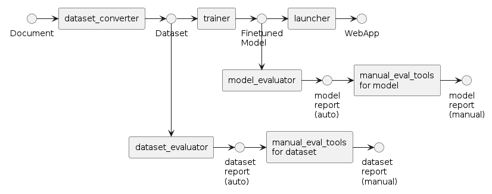
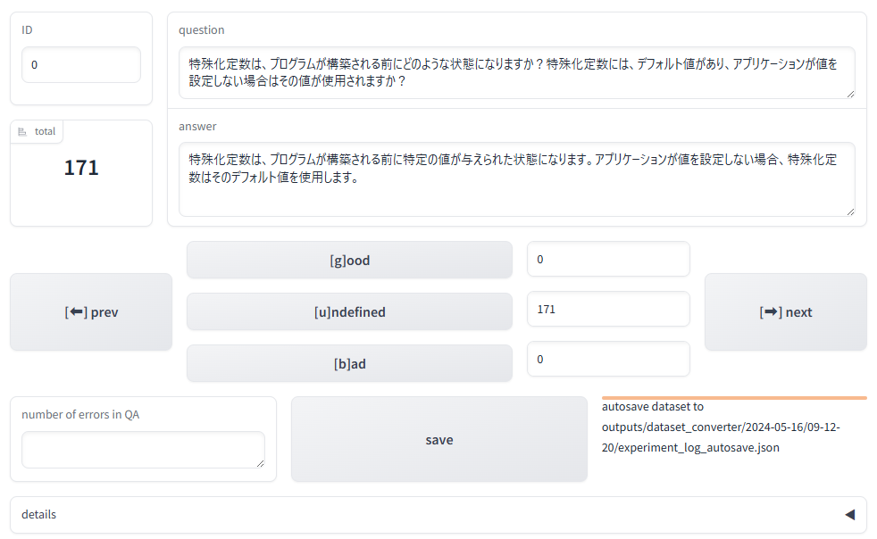
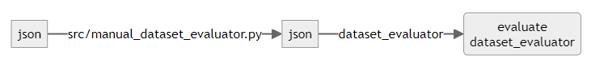
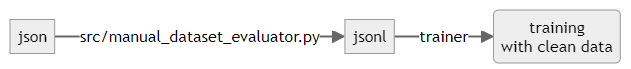
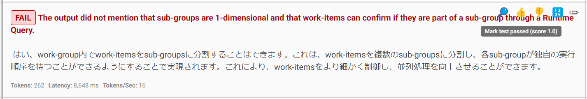
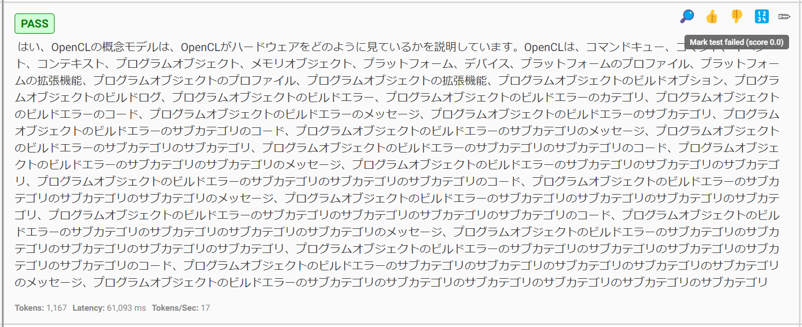

# 人力評価してフィードバックするチュートリアル

単純に自動評価をするだけでは、評価結果自体にも誤りが含まれている可能性があります。

このチュートリアルでは、そのような自動評価結果の誤りを訂正し、よりよいデータセット生成とモデル評価を実施しましょう。



## 前提条件

以下のチュートリアルが完了していることが必要です。

* [データセットを生成してチャットボットを展開する](./step-by-step.md)
* [データセットとモデルを評価する](./evaluation.md)

また、上記チュートリアルで実施したように`nvitop`コマンドを利用してGPUが空いていることを確認してください。

## データセットの人力評価

データセットを人力評価することで、モデルの精度を改善したり、`dataset_evaluator`自体の精度を検証することができます。

まず、次のコマンドを入力してUIを起動します。

```terminal
$ python src/run_manual_dataset_evaluator.py outputs/dataset_evaluator/<YYYY-MM-DD>/<HH-MM-SS>/experiment_log.json
Running on local URL:  http://127.0.0.1:7860

To create a public link, set `share=True` in `launch()`.
```

起動後、ポート転送を使うと[http://localhost:7860](http://localhost:7860)から、下記のような画面で生成された質問回答を確認することができます。
ただしFAIBサーバーにはファイアーウォールが設定されておりポート7860に直接アクセスできないため、説明書を参照してポート転送してください。



### 評価結果の修正

`total`には質問回答の総件数が表示されます。`dataset_evaluator`が質問回答を評価した結果は、画面左下の`num_error`欄に記載されています。中央下のボタンは質問回答の手動評価に使用します。また、各手動評価ボタンの右には、評価の件数が表示されます。

`experiment_log.json`と同じディレクトリ内に、手動保存した`experiment_log_manual_<YYYY-MM-DD-HH-MM-SS>.json`が存在する場合はそのうち最新のものが優先して読みこまれます。そうではなくて自動保存された`experiment_log_autosave.json`が存在する場合はそれが読みこまれます。どれも存在しない場合は無印の`experiment_log.json`が読み込まれます。（途中まで評価結果を修正した場合に、`save`しておくことで、途中まで評価したログを読み込むことが可能になります）

* `ID`に数値を指定して、リターンキーを押下すると、そのIDの質問回答に遷移します
* `good`ボタンを押すと質問回答は正しい（`num_error`が0である）とみなして、次の質問回答に遷移します
* `undefined`ボタンを押すと質問回答は未回答（`num_error`がNoneである）とみなして、次の質問回答に遷移します
* `bad`ボタンを押すと質問回答は誤り（`num_error`が1である）とみなして、次の質問回答に遷移します
* `next`ボタンを押すと次の質問回答に遷移します
* `prev`ボタンを押すと前の質問回答に遷移します
* `save`ボタンで評価結果を保存します

各ボタンはキーボードショートカットがあります。

|ボタン|キー|
|--|--|
|`good`|g|
|`undefined`|u|
|`bad`|b|
|`next`|方向キー（右）|
|`prev`|方向キー（左）|

その他の機能については[手動評価UIを利用するハウツー](../how-to-guides/manual-dataset-evaluator/evaluation-ui.md)を参照してください。

### 質問回答の修正

質問回答そのものを修正したい場合は、画面上のテキストボックスを直接書き換えてください。隣の質問回答に遷移する（`good`,`bad`,`next`,`prev`いずれかのボタンを押す）と、更新された質問回答がメモリに保存されます。

### 人力評価結果をフィードバックする

最後に`save`ボタンを押すと、`experiment_log_manual_<YYYY-MM-DD-HH-MM-SS>.json`と`dataset_manual_<YYYY-MM-DD-HH-MM-SS>_<judge>.jsonl`という2種類のファイルが出力されます。各ファイルの使い方は次の通りです。

#### jsonファイルをdataset_evaluatorの評価に使用する



`src/run_dataset_evaluator.py`にjsonファイルを渡すと、質問回答の自動評価が再度実施され、手動評価の結果との一致率を見ることができます。

```terminal
$ python src/run_dataset_evaluator.py inputs.name=outputs/dataset_evaluator/<YYYY-MM-DD>/<HH-MM-SS>/experiment_log_manual_<YYYY-MM-DD-HH-MM-SS>.json output.confusion_matrix=confusion_matrix.csv

[2024-03-27 20:16:32,238][preprocess.llm][INFO] - init PreprocessWithLLM: 73.358783 sec
Processed prompts: 100%|███████████████████████████████████████████████████████████████████████████████████| 406/406 [03:00<00:00,  2.25it/s]
[2024-03-27 20:19:33,508][preprocess.evaluate][INFO] - evaluate_dataset: 181.263905 sec / 406 QAs = 0.446463 sec/QA
[2024-03-27 20:19:33,584][preprocess.evaluate][INFO] - clean QA: 208 / 406 (51.231527 %)
[2024-03-27 20:19:33,587][preprocess.evaluate][INFO] - wrong QA: 133 / 406 (32.758621 %)
[2024-03-27 20:19:33,588][preprocess.evaluate][INFO] - invalid QA: 65 / 406 (16.009852 %)
[2024-03-27 20:19:33,612][preprocess.evaluate][INFO] - accuracy: 0.514778
[2024-03-27 20:19:33,612][preprocess.evaluate][INFO] - precision: 0.586466
[2024-03-27 20:19:33,612][preprocess.evaluate][INFO] - recall: 0.503226
[2024-03-27 20:19:33,612][preprocess.evaluate][INFO] - f1: 0.541667
[2024-03-27 20:19:33,615][preprocess.evaluate][INFO] -
|         |   clean |   wrong |   unknown |
|:--------|--------:|--------:|----------:|
| clean   |     131 |      77 |         0 |
| wrong   |      55 |      78 |         0 |
| invalid |      30 |      35 |         0 |
[2024-03-27 20:19:33,616][__main__][INFO] - execution time: 254.736552 sec
```

手動評価が実施されなかったものは`unknown`という分類がされます。

混同行列は各行（`invalid`がある）が自動評価、各列（`unknown`がある）が手動評価です。

#### jsonlファイルをtrainerに使用する



出力されるjsonlファイルは[評価のチュートリアル](./evaluation.md)と同様に`clean`,`wrong`,`invalid`という評価名がついています。

各jsonlファイルは、[学習のチュートリアル](./step-by-step.md#ファインチューン)での`dataset.data_files`で指定することでそのまま利用できます。
ただし、同じモデルに対してもう一度学習する場合は、`training_args.output_dir`を指定するのを忘れないようにしてください。

複数の手動評価の結果をtrainerに使用するには、[手動評価結果をデータセットに変換するハウツー](../how-to-guides/manual-dataset-evaluator/evaluation-convert-dataset.md)を参照してください。

#### 属性評価のスコアグラフを描画する

手動評価結果を利用すると、自動評価結果と比較するグラフの描画も実施できます。詳細は[評価指標の設定資料](../how-to-guides/dataset-evaluator/evaluation-metrics.md)を参照してください。

## モデルの人力評価

promptfooのウェブUIを使って、自動評価の結果を訂正することができます。

```sh
promptfoo view
```


👍ボタンを押すと、NGと評価されていたものをOKに訂正できます。



逆に、👎ボタンを押すと、OKをNGに訂正できます。


また、🔢ボタンを使えば、正答に対する部分点をつけることができます。✏️ボタンでは、コメントを残すこともできます。

人力評価が完了したら、コンソールのログに、評価結果が更新されたことが評価IDとともに表示されているはずです。

```terminal
$ promptfoo view

Updated eval with ID eval-<YYYY-MM-DD>T<HH-MM-SS>
```

この評価IDの結果を集計をするには以下のコマンドを実行してください。（IDは複数指定可）

```terminal
$ python scripts/manual_eval_tools/summarize_promptfoo.py eval-<YYYY-MM-DD>T<HH-MM-SS>
eval-<YYYY-MM-DD>T<HH-MM-SS>
openai:completion:finetuned : 85.9873 %
openai:completion:baseline : 70.0637 %
```

## 次にやること

[パイプラインを自動実行するチュートリアル](./auto-pipeline.md)を導入すると、より効率的に開発が進められるかもしれません。
もっとモデルを改善するためには、[各種のハウツー](../README.md)も試してみましょう。
