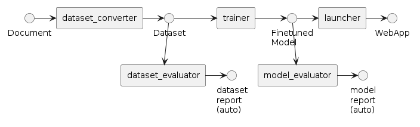
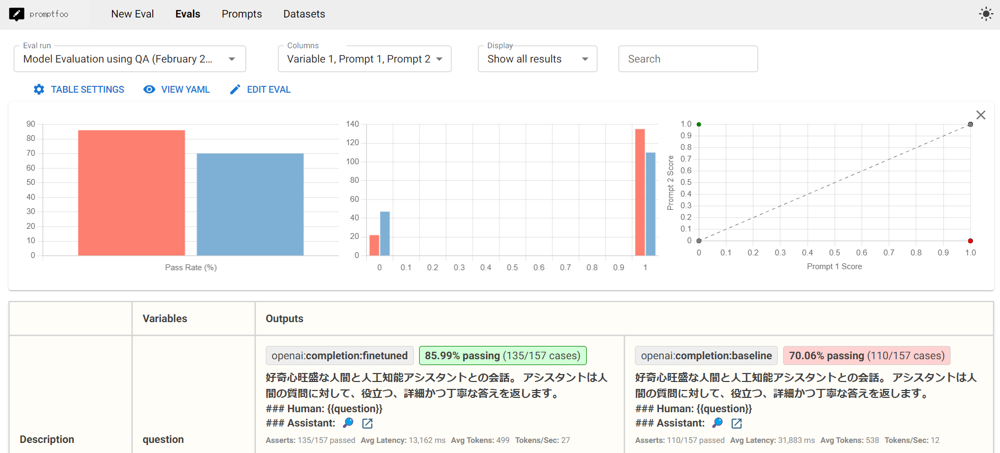

# データセットとモデルを評価するチュートリアル

このチュートリアルでは、生成されたデータセットとモデルをどのように自動評価するかを解説します。



## 前提条件

以下のチュートリアルが完了していることが必要です。

* [データセットを生成してチャットボットを展開する](./step-by-step.md)

また、上記チュートリアルで実施したように`nvitop`コマンドを利用してGPUが空いていることを確認してください。

## データセットの評価

以前のチュートリアルを終えていると、`experiment_log.json`というファイルが、`outputs/dataset_converter/<YYYY-MM-DD>/<HH-MM-SS>`のディレクトリに保存されているはずです。このファイルには、どのようにデータセットの質問・回答の組を生成したかが記録されています。

```json
[
    {
        "convert_template": "ja/qa_zeroshot_json.jinja2",
        "prompt": "(prompt)",
        "output": [
            "(output 0)",
            "(output 1)",
            ...
        ],
        "page": {
            "page": "(page as context)"
        },
        "qa": [
            {
                "question": "(question)",
                "answer": "(answer)"
            },
            ...
        ]
    },
    ...
]
```

`dataset_evaluator`は、このファイルをLLMを使って事実チェックを実施します。ここでは、[karakuri-ai/karakuri-lm-7b-apm-v0.1](https://huggingface.co/karakuri-ai/karakuri-lm-7b-apm-v0.1/tree/main)モデルを使ってみましょう。

```terminal
$ python scripts/download_model.py karakuri-ai/karakuri-lm-7b-apm-v0.1
$ python src/run_dataset_evaluator.py inputs.name=outputs/dataset_converter/<YYYY-MM-DD>/<HH-MM-SS>/experiment_log.json

[2024-07-12 07:33:59,736][preprocess.llm][INFO] - init PreprocessWithLLM: 44.879572 sec
Processed prompts: 100%|███████████████████████████████████████████████████████████| 171/171 [00:05<00:00, 33.31it/s]
[2024-07-12 07:34:05,978][preprocess.llm][INFO] - llm: 2658.512897 token/sec (14364 token / 5.403021 sec) with {'provider': 'vllm', 'model': 'karakuri-ai/karakuri-lm-7b-apm-v0.1', 'max_ok_error_threshold': -1.0, 'max_tokens': 4096, 'generate': {'num_return_sequences': 3, 'max_new_tokens': 32, 'temperature': 1, 'top_p': 0.95, 'do_sample': True}, 'batch_size': 16, 'api_base_url': 'http://localhost:8001/v1', 'api_key': 'hoge', 'vllm_tensor_parallel_size': 2, 'vllm_max_num_seqs': 256}
Processed prompts: 100%|███████████████████████████████████████████████████████████| 171/171 [00:04<00:00, 37.18it/s]
[2024-07-12 07:34:11,688][preprocess.llm][INFO] - llm: 2326.038884 token/sec (11286 token / 4.852026 sec) with {'provider': 'vllm', 'model': 'karakuri-ai/karakuri-lm-7b-apm-v0.1', 'max_ok_error_threshold': -1.0, 'max_tokens': 4096, 'generate': {'num_return_sequences': 3, 'max_new_tokens': 32, 'temperature': 1, 'top_p': 0.95, 'do_sample': True}, 'batch_size': 16, 'api_base_url': 'http://localhost:8001/v1', 'api_key': 'hoge', 'vllm_tensor_parallel_size': 2, 'vllm_max_num_seqs': 256}
[2024-07-12 07:34:11,731][preprocess.evaluate][INFO] - evaluate_dataset: 11.994114 sec / 171 QAs = 0.070141 sec/QA
[2024-07-12 07:34:11,868][preprocess.evaluate][INFO] - clean QA: 14 / 171 (8.187135 %)
[2024-07-12 07:34:11,869][preprocess.evaluate][INFO] - output_filtered_qa (clean): outputs/dataset_evaluator/<YYYY-MM-DD>/<HH-MM-SS>/dataset_clean.jsonl
[2024-07-12 07:34:11,869][preprocess.evaluate][INFO] - wrong QA: 157 / 171 (91.812865 %)
[2024-07-12 07:34:11,872][preprocess.evaluate][INFO] - output_filtered_qa (wrong): outputs/dataset_evaluator/<YYYY-MM-DD>/<HH-MM-SS>/dataset_wrong.jsonl
[2024-07-12 07:34:11,872][preprocess.evaluate][INFO] - invalid QA: 0 / 171 (0.000000 %)
[2024-07-12 07:34:11,872][preprocess.evaluate][INFO] - output_filtered_qa (invalid): outputs/dataset_evaluator/<YYYY-MM-DD>/<HH-MM-SS>/dataset_invalid.jsonl
[2024-07-12 07:34:11,895][preprocess.sft_convert][INFO] - output_experimental_log: outputs/dataset_evaluator/<YYYY-MM-DD>/<HH-MM-SS>/experiment_log.json
[2024-07-12 07:34:11,896][__main__][INFO] - execution time: 57.039164 sec
```

上記の結果のように、質問回答はそれぞれ、3つのカテゴリに振り分けられることになります。振り分けの詳細な手順や調整の方法については[評価指標の設定資料](../how-to-guides/dataset-evaluator/evaluation-metrics.md)を参照してください。

評価の詳細は、`experiment_log.json`というファイルが`outputs/dataset_evaluator/<YYYY-MM-DD>/<HH-MM-SS>`のディレクトリに保存されているはずです。

```json
[
    {
        "convert_template": "ja/qa_zeroshot_json.jinja2",
        "evaluate_template": "ja/verify_dataset_by_karakuri_apm.jinja2",
        "prompt": "<bos>[INST] (question) [/INST] (answer) [ATTR_1]",
        "output": (raw-output-by-karakuri-apm),
        "page": {
            "page": "(page as context)"
        },
        "qa": [
            {
                "question": "(question)",
                "answer": "(answer)"
            }
        ],
        "score": <score>,
        "num_error": (error count),
        "previous_num_error": null
    },
```

評価に合格したものは`dataset_clean.jsonl`に保存され、これを学習に使うことができます。
一方の不合格なものは、それぞれ`dataset_wrong.jsonl`と`dataset_invalid.jsonl`に保存されています。

発展として、

* 他のモデルを使って評価するには、`config/dataset_evaluator`ディレクトリに`<new_config>.yaml`を作成し、実行時の引数に`--config-name=<new_config>`を指定してください。
* 合否判定の方法をカスタマイズするには、[評価指標を設定するハウツー](../how-to-guides/dataset-evaluator/evaluation-metrics.md)または[正誤判定結果の自動調整ハウツー](../how-to-guides/dataset-evaluator/evaluation-calculate-coefficient.md)を参照してください。
* 評価結果を利用して新しいプロンプトを生成するには、[プロンプトを自動生成するハウツー](../how-to-guides/dataset-evaluator/dataset-convert-prompt-generate.md)を参照してください。

## モデル評価

学習済モデルに質問して回答を得て、それを正答と比較することでモデルの精度を評価できます。

ここでは、結果の可視化まで実施するため[promptfoo](https://www.promptfoo.dev/docs/intro/)を導入します。

```sh
# NVMの導入
curl -o- https://raw.githubusercontent.com/nvm-sh/nvm/v0.39.7/install.sh | bash
source ~/.bashrc
nvm install v20.15.0

# promptfooの導入
sudo apt install npm
npm install -g promptfoo@0.66.0
```

```terminal
$ promptfoo help
Usage: promptfoo [options] [command]

（以下略）
```

次に、ファインチューン済みのモデルを、peft形式からhuggingface形式に変換します。

```terminal
$ python src/model_evaluator/merge_peft_model.py outputs/trainer/<YYYY-MM-DD>/<HH-MM-SS>/checkpoint-<STEP>/

Loading checkpoint shards: 100%|███████████████████████████████████████████| 29/29 [00:16<00:00,  1.79it/s]
Unloading and merging model: 100%|█████████████████████████████████████| 1687/1687 [02:02<00:00, 13.74it/s]
```

完了すると、huggingface形式のモデルが`outputs/trainer/<YYYY-MM-DD>/<HH-MM-SS>/checkpoint-<STEP>-merged`に保存されているはずです。

この変換されたモデルを、本チュートリアルではSwallow-MX-8x7b-NVE-v0.1を使ったLLM-as-a-Judgeで評価してみます。

```terminal
$ python src/run_model_evaluator.py outputs/trainer/<YYYY-MM-DD>/<HH-MM-SS>/checkpoint-<STEP>-merged tokyotech-llm/Swallow-70b-instruct-hf --data-files data/OpenCL_API.jsonl --output outputs/OpenCL_API_eval.csv --inference-template templates/ja/promptfoo_swallow_70b.jinja2

Eval: [████████████████████████████████████████] 100% | ETA: 0s | 328/328 | openai:completion:baseline "好奇心旺盛な人間と人" question=O


┌──────────────────────────────────────┬──────────────────────────────────────┬──────────────────────────────────────┐
│ question                             │ [openai:completion:finetuned] 好奇…  │ [openai:completion:baseline] 好奇心… │
│                                      │ 人間と人工知能アシスタントとの会話…  │ 間と人工知能アシスタントとの会話。 … │
│                                      │ 役立つ、詳細かつ丁寧な答えを返しま…  │ 立つ、詳細かつ丁寧な答えを返します。 │
│                                      │ ### Human: {{question}}              │ ### Human: {{question}}              │
│                                      │ ### Assistant:                       │ ### Assistant:                       │
├──────────────────────────────────────┼──────────────────────────────────────┼──────────────────────────────────────┤
│ OpenCL platformでは、オンラインコン… │ [PASS]  はい、OpenCL platform        │ [PASS]  はい、OpenCLプラットフォー…  │
│ ロファイルと、オンラインコンパイラ…  │ では、オンラインコンパイラを提供す…  │ は、オンラインコンパイラを提供する…  │
│ の2種類があるということですね？      │ イラを提供する必要はない冗談プロフ…  │ ラを提供する必要はない冗談プロファ…  │
│                                      │ フルプロファイルでは、OpenCLコマン…  │ ります。                             │
│                                      │ ホストプログラムからのコマンドキュ…  │ フルプロファイルは、OpenCLアプリケ…  │
│                                      │ ラによってコンパイルされます。これ…  │ べての機能を提供します。これには、…  │
│                                      │ ューに登録されたコマンドが実行され…  │ ラリ、およびデバイスドライバが含ま…  │
│                                      │ できます。                           │ nCLアプリケーションを完全に実行する… │
│                                      │ 一方、冗談プロフ...                  │ す。                                 │
│                                      │                                      │ 一方...                              │
├──────────────────────────────────────┼──────────────────────────────────────┼──────────────────────────────────────┤
│ OpenCL上のカスタムデバイスは、カス…  │ [FAIL] The output                    │ [FAIL] The output                    │
│ ルしかサポートしていないということ…  │  and the answer have different infor │  and the answer have different infor │
│                                      │ mation regarding the capability of c │ mation regarding the support of Open │
│                                      │ ustom devices in OpenCL. The output  │ CL kernels on custom devices. The ou │
│                                      │ states that custom devices support b │ tput states that custom devices supp │
│                                      │ oth standard and custom kernels, whi │ ort both custom and general OpenCL k │
│                                      │ le the answer states that custom dev │ ernels, while the answer states that │
│                                      │ ices only support bui...             │  custom devices only ...             │

(omitted)

Writing output to outputs/OpenCL_API_eval.csv
====================================================================================================================
✔ Evaluation complete.

» Run promptfoo view to use the local web viewer
» Run promptfoo share to create a shareable URL
» This project needs your feedback. What's one thing we can improve? https://forms.gle/YFLgTe1dKJKNSCsU7
====================================================================================================================
Successes: 67
Failures: 261
Token usage: Total 401673, Prompt 238950, Completion 162723, Cached 0
Done.
```

この結果をpromptfooで見てみましょう。

```sh
promptfoo view
```

起動後、ポート転送を使うと[http://localhost:15500](http://localhost:15500)から、下記のような画面でウェブブラウザ上からファインチューンしたモデルの評価結果を確認することができます。
ただしFAIBサーバーにはファイアーウォールが設定されておりポート15500に直接アクセスできないため、説明書を参照してポート転送してください。

ブラウザでは以下のような画面が表示され、元になったモデルと比較してファインチューン済みのモデルの正答率が高くなっていることが確認できるはずです。



発展として、

* Swallow-MX-8x7b-NVE-v0.1以外のモデルを評価器として用いたい場合は、[評価に使うモデルを選ぶハウツー](../how-to-guides/model-evaluator/evaluation-model.md)を参照してください。
* 評価用のプロンプトを変更するには、[評価に使うプロンプトを選ぶハウツー](../how-to-guides/model-evaluator/evaluation-prompt.md)を参照してください。

## 次にやること

[人力評価してフィードバックするチュートリアル](./evaluation-human-in-the-loop.md)を実施して、自動評価の結果を改善してみてください。

ここまでの手順を全て自動で実行したい場合、[パイプラインを自動実行するチュートリアル](./auto-pipeline.md)も実施してみてください。
