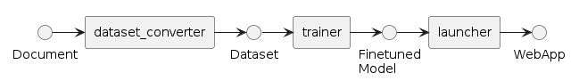
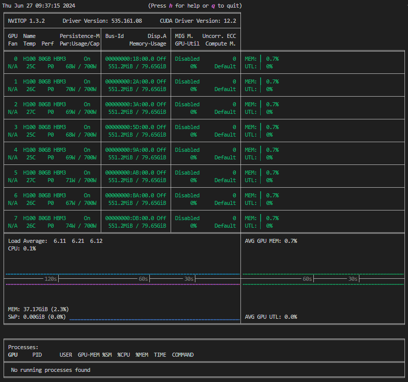
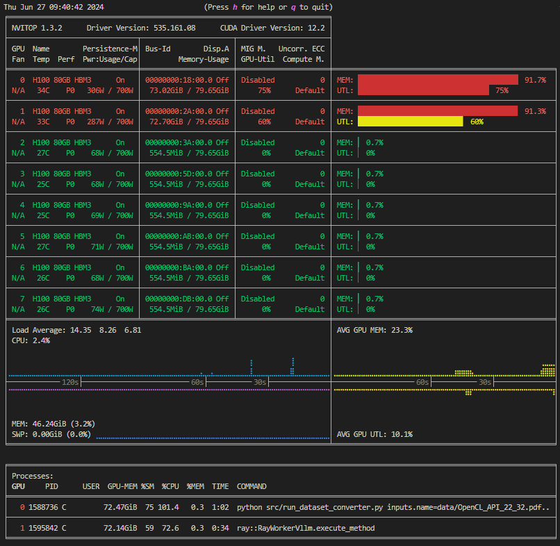
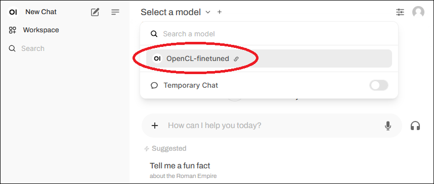
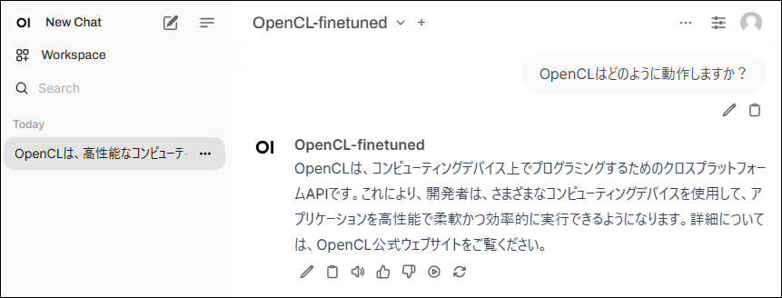
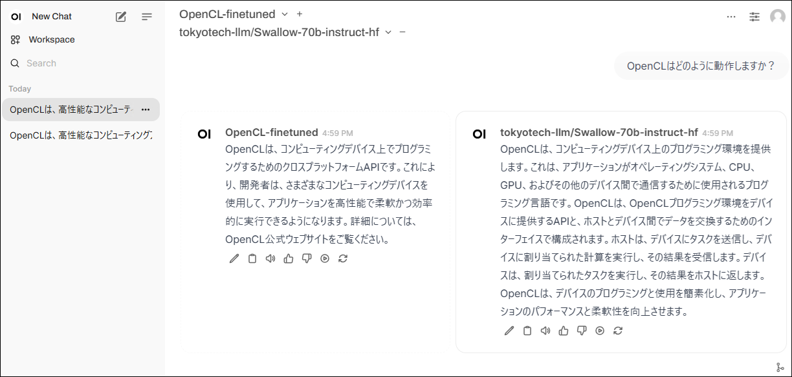

# データセットを生成してチャットボットを展開するチュートリアル

以下の図のように、モデルを構築するパイプラインは大きく3つのモジュールに分かれており、それぞれ`dataset_converter`、`trainer`、`launcher`になっています。



このチュートリアルでは、このパイプラインを実行し、小さなPDFを使ってモデルを開発してみましょう。

## 前提条件

以下の構成を前提としています:

* FAIBサーバー上である
* MDKのパッケージを展開済みで、`cd <MDKパッケージをcloneした場所>`を行い、カレントディレクトリを変更してある

## 環境の構築

まずは、venvを用いて、このパイプラインを実行するための環境を構築しましょう。

```sh
# Pythonの仮想環境を作る
python3 -m venv .venv
. .venv/bin/activate

# 必要なパッケージを導入する
pip install pip==24.1.2 wheel==0.43.0 setuptools==71.0.4
pip install -r requirements.txt
pip install deepspeed==0.14.4  # PyTorchの後に導入する必要があるため別実行
```

## モデルのダウンロード

このチュートリアルでは、以下のモデルを使います。

* [llava-hf/llava-1.5-7b-hf](https://huggingface.co/llava-hf/llava-1.5-7b-hf)：入力するPDFファイルに含まれる画像の読み取り
* [tokyotech-llm/Swallow-MX-8x7b-NVE-v0.1](https://huggingface.co/tokyotech-llm/Swallow-MX-8x7b-NVE-v0.1)：データセットの生成と評価
* [tokyotech-llm/Swallow-70b-instruct-hf](https://huggingface.co/tokyotech-llm/Swallow-70b-instruct-hf)：学習
* [tokyotech-llm/Llama-3-Swallow-8B-Instruct-v0.1](https://huggingface.co/tokyotech-llm/Llama-3-Swallow-8B-Instruct-v0.1)：学習（利用可能なGPU数が少ないとき）

そのため、先に以下のコマンドで、あらかじめこれらのダウンロードを実行しておいてください。概ね数時間かかります。

```terminal
$ python scripts/download_model.py llava-hf/llava-1.5-7b-hf tokyotech-llm/Swallow-MX-8x7b-NVE-v0.1 tokyotech-llm/Swallow-70b-instruct-hf tokyotech-llm/Llama-3-Swallow-8B-Instruct-v0.1

INFO:__main__:completed processing 4 models
```

ダウンロードされたモデルは`$HF_HOME/hub/`に保存されているはずです。

```terminal
$ ls $HF_HOME/hub/
models--llava-hf--llava-1.5-7b-hf  models--tokyotech-llm--Swallow-MX-8x7b-NVE-v0.1  models--tokyotech-llm--Swallow-70b-instruct-hf  models--tokyotech-llm--Llama-3-Swallow-8B-Instruct-v0.1
```

## GPUの空き確認

これ以降の処理ではGPUメモリを使用するため、GPUが空いているかを次のコマンドで確認します。

```sh
nvitop
```

左図のようになっている場合はすべてのGPUが空いており使用可能です。右図ではGPU0,1が使用中、GPU2～7が空いていることが分かります。

|空き|使用中|
|--|--|
|||

すべてのGPUが使用中のときは以降のチュートリアルは実行できません。nvitop下段のプロセスリストに記載されたユーザーかサーバー管理者に問い合わせてください。

空いているGPUが2枚以上ある場合はこのチュートリアルは実行可能です。下記のように環境変数を設定して、使うGPUを指定してください。

```sh
# GPU2,3を使用する場合
export CUDA_VISIBLE_DEVICES=2,3
```

その他、GPUの確保に関するエラーについては[GPU out of memoryエラーの対応方法](../how-to-guides/etc/out-of-memory.md)を参照してください。

最後に、`nvitop`を終了するために`q`キーを押下します。

## データセットの準備

`pypdf`などではPDFを単純なテキストに変換できますが、表などが含まれているとうまくLLMで学習することができません。
そこで、最初に、LLMが学習しやすいデータセットに変換・生成しましょう。
このチュートリアルでは、生成にSwallow-MX-8x7b-NVE-v0.1モデルを使います。

今回は例として、OpenCL APIに関する仕様書のPDFを用います。

まず、`OpenCL_API.pdf`をダウンロードし、チュートリアル用に23ページ目から32ページ目までの10ページだけ切り出します。
実行後、`OpenCL_API_23_32.pdf`が作成されていることを確認してください。

```terminal
$ curl -o data/OpenCL_API.pdf https://registry.khronos.org/OpenCL/specs/3.0-unified/pdf/OpenCL_API.pdf
$ python scripts/cut_pdf_file.py data/OpenCL_API.pdf 23 32
data/OpenCL_API_23_32.pdf was created.
$ ls data/
OpenCL_API_23_32.pdf  OpenCL_API.pdf
```

これをデータセットに変換します。

```terminal
$ python src/run_dataset_converter.py inputs.name=data/OpenCL_API_23_32.pdf

split pdf page: 100%|█████████████████████████████████████| 10/10 [00:00<00:00, 114.92it/s]
INFO 07-12 07:27:11 model_runner.py:867] Graph capturing finished in 5 secs.
[2024-07-12 07:27:11,908][preprocess.llm][WARNING] - no examples found. converting without examples...
[2024-07-12 07:27:11,910][preprocess.llm][INFO] - init PreprocessWithLLM: 89.497113 sec
(RayWorkerVllm pid=2757175) INFO 07-12 07:27:11 model_runner.py:867] Graph capturing finished in 5 secs.
Processed prompts: 100%|███████████████████████████████████| 10/10 [00:28<00:00,  2.86s/it]
[2024-07-12 07:27:40,990][preprocess.llm][INFO] - llm: 1433.012733 token/sec (41018 token / 28.623612 sec) with {'provider': 'vllm', 'model': 'tokyotech-llm/Swallow-MX-8x7b-NVE-v0.1', 'max_tokens': 4096, 'generate': {'num_return_sequences': 4, 'max_new_tokens': 1024, 'temperature': 1, 'top_p': 0.95, 'do_sample': True}, 'batch_size': 16, 'api_base_url': 'http://localhost:8001/v1', 'api_key': 'hoge', 'vllm_tensor_parallel_size': 2, 'vllm_max_num_seqs': 256}
[2024-07-12 07:27:40,996][preprocess.sft_convert][INFO] - convert: 29.085648 sec / 10 pages = 2.908565 sec/page
[2024-07-12 07:27:41,080][preprocess.sft_convert][INFO] - output_dataset: outputs/dataset_converter/<YYYY-MM-DD>/<HH-MM-SS>/dataset.jsonl
[2024-07-12 07:27:41,083][preprocess.sft_convert][INFO] - output_experimental_log: outputs/dataset_converter/<YYYY-MM-DD>/<HH-MM-SS>/experiment_log.json
[2024-07-12 07:27:41,083][__main__][INFO] - execution time: 135.914696 sec

$ cp outputs/dataset_converter/<YYYY-MM-DD>/<HH-MM-SS>/dataset.jsonl data/OpenCL_API.jsonl
```

得られたファイル`data/OpenCL_API.jsonl`の中身は以下のようになっているはずです。

```json
{"question": "特殊化定数は、プログラムが構築される前にどのような状態になりますか？特殊化定数には、デフォルト値があり、アプリケーションが値を設定しない場合はその値が使用されますか？", "answer": "特殊化定数は、プログラムが構築される前に特定の値が与えられた状態になります。アプリケーションが値を設定しない場合、特殊化定数はそのデフォルト値を使用します。"}
{"question": "SPMDプログラムモデルは、どのような意味を持つのですか？複数のプロセッシング要素が、それぞれに異なるデータとプログラムカウンタを持ちながら、同じプログラムを同時に実行することを特徴としますか？", "answer": "SPMDは、Single Program Multiple Dataの略です。これは、複数のプロセッシング要素が異なるデータとプログラムカウンタを持ちながら、同じプログラムを実行することを特徴とするプログラムモデルです。"}
{"question": "OpenCLデバイスを複数のサブデバイスに分割することはできますか？それとも、サブデバイスはある種の部分的なデバイスですか？そして、サブデバイスはどのように使用することができますか？", "answer": "OpenCLデバイスをサブデバイスに分割することができます。サブデバイスは、ある種の部分的なデバイスであり、親デバイスと同じように使用することができます。"}
{"question": "OpenCLで、サブグループとは何ですか？サブグループのサイズや数はどのように決定されますか？", "answer": "サブグループは、OpenCLのワークグループ内のワークアイテムのグループです。サブグループのサイズと数は、実装によって異なります。"}
{"question": "サブグループバリアとは何ですか？簡単に説明してください。", "answer": "サブグループバリアは、特定のワークグループ内のワークアイテムのグループ（サブグループ）に対して、メモリ操作の同期を行うために使用される同期バリアです。"}

（以下略）
```

発展として、

* 生成にSwallow-MX-8x7b-NVE-v0.1以外のモデルを用いる場合やOpenCL API以外のデータセットを用いる場合には、[データセット変換器の設定を変更するハウツー](../how-to-guides/dataset-converter/dataset-convert-adjust.md)を参照してください。
* 実際にOpenCL API以外のデータセットを用いた例については[データセット変換例のハウツー](../how-to-guides/dataset-converter/dataset-convert-examples.md)を参照してください。
* データセットの変換（モデル推論）に要した時間を詳細に計測するには、Fixstars AI Booster(FAIB)を利用してください。

## ファインチューン

モデルのすべてのパラメータを更新するファインチューンを実行するには大量のメモリが必要です。
そこで、このチュートリアルではメモリ削減技術である[LoRA](https://arxiv.org/abs/2106.09685)と[DeepSpeed Zero Level 3](https://github.com/microsoft/DeepSpeed)を使って、FP16で学習を実行します。

このチュートリアルでは、`Swallow-70b-instruct-hf`または`Llama-3-Swallow-8B-Instruct-v0.1`をSFTによってファインチューンしてみます。

なお、ここで、`--hostfile=/dev/null`を`deepspeed`コマンドに与えていることに注意してください。
この設定を行わない場合、意図しないhostfileが使われることがあります。hostfileが存在していないことを明示することで、ローカルで使用可能なすべてのGPUが自動的に使われます。使用可能なGPUは`${CUDA_VISIBLE_DEVICES}`を用いて制限することができます。

```terminal
# 70Bモデルを学習する場合（8GPUが必要）
$ deepspeed --hostfile=/dev/null src/run_trainer.py config/trainer/Swallow-70b.yaml dataset.data_files=data/OpenCL_API.jsonl

{'loss': 2.0889, 'grad_norm': 0.3730774956436285, 'learning_rate': 4.741379310344828e-05, 'epoch': 1.0}
{'loss': 1.3987, 'grad_norm': 0.18718068143507235, 'learning_rate': 4.224137931034483e-05, 'epoch': 2.0}
{'loss': 1.0791, 'grad_norm': 0.13064470377345921, 'learning_rate': 3.7068965517241385e-05, 'epoch': 3.0}
{'loss': 0.9286, 'grad_norm': 0.12758933692294408, 'learning_rate': 3.1896551724137935e-05, 'epoch': 4.0}
{'loss': 0.8577, 'grad_norm': 0.13350309522165707, 'learning_rate': 2.672413793103448e-05, 'epoch': 5.0}
{'loss': 0.8112, 'grad_norm': 0.12411751118582741, 'learning_rate': 2.1551724137931033e-05, 'epoch': 6.0}
{'loss': 0.7594, 'grad_norm': 0.12388292438227493, 'learning_rate': 1.6379310344827585e-05, 'epoch': 7.0}
{'loss': 0.7261, 'grad_norm': 0.11511960632425634, 'learning_rate': 1.1206896551724138e-05, 'epoch': 8.0}
{'loss': 0.7173, 'grad_norm': 0.11644596951830292, 'learning_rate': 6.03448275862069e-06, 'epoch': 9.0}
{'loss': 0.7076, 'grad_norm': 0.11765243726713139, 'learning_rate': 8.620689655172415e-07, 'epoch': 10.0}
{'train_runtime': 1441.8513, 'train_samples_per_second': 1.235, 'train_steps_per_second': 0.042, 'train_loss': 1.007440988222758, 'epoch': 10.0}
100%|██████████████████████████████████████████████████████████████████████| 60/60 [24:01<00:00, 24.03s/it]
INFO:__main__:output_dir: ./outputs/trainer/<YYYY-MM-DD>/<HH-MM-SS>


# 8Bモデルを学習する場合（1GPU以上で実行可能）
# deepspeedは内部でCUDA_VISIBLE_DEVICES環境変数を書き換えるので、対応する入力形式に変換する
$ MDK_DEEPSPEED_DEVICES="${CUDA_VISIBLE_DEVICES}"
$ unset CUDA_VISIBLE_DEVICES
$ deepspeed --include="localhost:${MDK_DEEPSPEED_DEVICES}" src/run_trainer.py config/trainer/Llama-3-Swallow-8B.yaml dataset.data_files=data/OpenCL_API.jsonl

{'loss': 2.4266, 'grad_norm': 0.8681862936528184, 'learning_rate': 4.6186440677966104e-05, 'epoch': 1.0}
{'loss': 1.0861, 'grad_norm': 0.30515030570807244, 'learning_rate': 4.110169491525424e-05, 'epoch': 2.0}
{'loss': 0.8938, 'grad_norm': 0.2049570480677632, 'learning_rate': 3.601694915254237e-05, 'epoch': 3.0}
{'loss': 0.8136, 'grad_norm': 0.20927063246863076, 'learning_rate': 3.093220338983051e-05, 'epoch': 4.0}
{'loss': 0.7679, 'grad_norm': 0.19345112386794103, 'learning_rate': 2.5847457627118642e-05, 'epoch': 5.0}
{'loss': 0.7258, 'grad_norm': 0.2199780861065827, 'learning_rate': 2.076271186440678e-05, 'epoch': 6.0}
{'loss': 0.6848, 'grad_norm': 0.24114699760748834, 'learning_rate': 1.5677966101694916e-05, 'epoch': 7.0}
{'loss': 0.6565, 'grad_norm': 0.24490263707370302, 'learning_rate': 1.0593220338983052e-05, 'epoch': 8.0}
{'loss': 0.6346, 'grad_norm': 0.35097990668123724, 'learning_rate': 5.508474576271187e-06, 'epoch': 9.0}
{'loss': 0.6215, 'grad_norm': 0.28866325554349587, 'learning_rate': 4.2372881355932204e-07, 'epoch': 10.0}
100%|██████████████████████████████████████████████████████████████████████| 120/120 [05:14<00:00,  2.62s/it]
INFO:__main__:output_dir: ./outputs/trainer/<YYYY-MM-DD>/<HH-MM-SS>

# 終了後、CUDA_VISIBLE_DEVICES環境変数を元に戻す
$ export CUDA_VISIBLE_DEVICES="${MDK_DEEPSPEED_DEVICES}"
```

発展として、

* 学習中および完了後のモデルはMLflowを用いて管理することもできます。詳しくは[MLflowを使うハウツー](../how-to-guides/trainer/use-mlflow.md)を参照してください。
* `Swallow-70b-instruct-hf`または`Llama-3-Swallow-8B-Instruct-v0.1`以外のモデルをファインチューンしたい場合には、[学習対象のモデルを選ぶハウツー](../how-to-guides/trainer/train-model.md)を参照してください。
* SFTでなくDPOを用いたい場合には、[DPOモデルの学習ハウツー](../how-to-guides/trainer/train-dpo.md)を参照してください。
* 学習に要した時間を詳細に計測するには、Fixstars AI Booster(FAIB)を利用してください。

## モデル形式の変換

次に、ファインチューン済みのモデルを、peft形式からhuggingface形式に変換します。

```terminal
$ python src/model_evaluator/merge_peft_model.py outputs/trainer/<YYYY-MM-DD>/<HH-MM-SS>/checkpoint-<STEP>/

Loading checkpoint shards: 100%|███████████████████████████████████████████| 29/29 [00:16<00:00,  1.79it/s]
Unloading and merging model: 100%|█████████████████████████████████████| 1687/1687 [02:02<00:00, 13.74it/s]
```

完了すると、huggingface形式のモデルが`outputs/trainer/<YYYY-MM-DD>/<HH-MM-SS>/checkpoint-<STEP>-merged`に保存されているはずです。

## チャットサーバーの起動

実際にチャットしてみるため、ウェブサーバーを起動しましょう。
まずは設定ファイルを作成します。既存の設定ファイルを複製して利用します。

```sh
mkdir -p outputs/launcher/
cp config/launcher/checkpoint-x-merged.yaml outputs/launcher/opencl_finetuned.yaml
```

次に設定ファイル内の`MODELS`を下記を参考に変更します。（モデルのパスを絶対パスで指定します）

```yaml
MODELS:
  - <path to mdk>/outputs/trainer/yyyy-mm-dd/hh-MM-ss/checkpoint-<STEP>-merged
```

最後に設定ファイルを指定してDockerを起動します。

```sh
(.venv) $ src/run_launcher.sh outputs/launcher/opencl_finetuned.yaml
Config files ['docker-compose.yml', 'litellm-config.yml'] generated successfully.
[+] Running 4/4
 ✔ Network launcher_default       Created                   0.1s
 ✔ Container launcher-vllm1       Started                   2.2s
 ✔ Container launcher-litellm     Started                   2.5s
 ✔ Container launcher-open-webui  Started
Displaying log... press Ctrl+C to exit.
launcher-open-webui  | Loading WEBUI_SECRET_KEY from file, not provided as an environment variable.
launcher-open-webui  | Generating WEBUI_SECRET_KEY
launcher-open-webui  | Loading WEBUI_SECRET_KEY from .webui_secret_key
...
```

起動してしばらく待った後以下のようなログが表示されたら起動完了です。（初回は5分以上かかる可能性があります）

```sh
launcher-vllm1       | INFO:     Started server process [1]
launcher-vllm1       | INFO:     Waiting for application startup.
launcher-vllm1       | INFO:     Application startup complete.
launcher-vllm1       | INFO:     Uvicorn running on http://0.0.0.0:8000 (Press CTRL+C to quit)
```

ポート転送を使って[http://localhost:3000](http://localhost:3000)にアクセスします。
ただしFAIBサーバーにはファイアーウォールが設定されておりポート3000に直接アクセスできないため、説明書を参照してポート転送してください。

下記のような画面が表示されたらドロップダウンリストからファインチューンしたモデルを選択します。



その後、選択したモデルに対して指示や質問を出すことができます。



停止する場合は`Ctrl+C`キーを押下してください。

ファインチューン前後のモデルを比較したい場合、`config/launcher/checkpoint-x-merged_swallow70b.yaml`を参考に設定ファイルを作成して起動すると対比機能を使うことができます。



その他のチャット画面の使い方についてはopen-webuiの[Documentation](https://docs.openwebui.com/)ページをご確認ください。

発展として、

* チャット設定ファイルの詳細は、[チャットの詳細設定を変更するハウツー](../how-to-guides/launcher/launch-settings.md)を参照してください。
* ウェブサーバー以外でチャットサービスを展開する方法については、[VSCode拡張でモデルを利用するハウツー](../how-to-guides/launcher/vscode-integration.md)を参照してください。

## 次にやること

[評価のチュートリアル](./evaluation.md)を実施し、生成したデータセットやモデルを、LLMを使って自動評価してみましょう。
